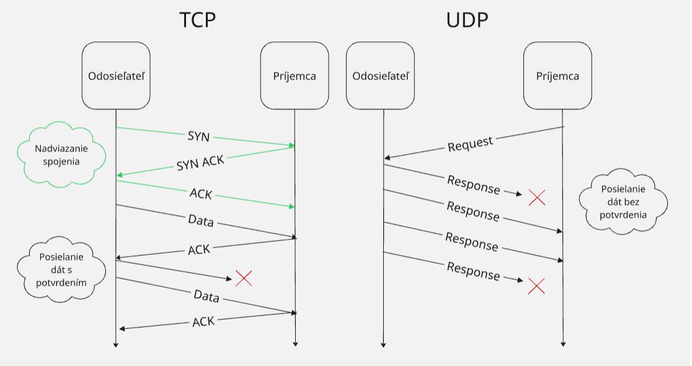
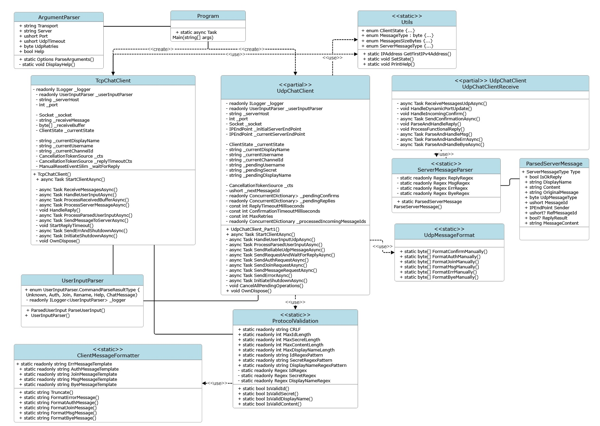

  
  # `IPK25-CHAT`    
  ## Dokumentácia k 2. úlohe do IPK 2024/2025    
 **Autor:** Jakub Fiľo - xfiloja00    
    
### 1. Teória k Projektu    
    
 * TCP (Transmission Control Protocol)    
Je to protokol transportnej vrstvy, ktorý umožnuje spolahlive pripojenie k cielovím zariadeniam. Ako prvé nadviaže spojenie pomocou **three-way handshake** kde sa overí pripojenie a až potom posiela dáta. Dáta mozu byt rozdelene do segmentov kvôli velkosti posielanych dat. Protokol TCP vykonova kontrolu aby zarucil ze sa packety nestratia, ku kazdemu packetu pridarí poradové cislo, ktore hovori prijemcovi ake packety mu prichadzaju alebo sa stratili, ak sa packet strati, to znamena ze odosielatel nedostane **ACK** (**acknowledgement**)- správu tak packet pošle znova. Prijemca tiez podla poradovych čisiel vie zostavit data podla poradia.    
 * UDP (User Datagram Protocol)    
Protokol transportnej vrstvy, označovany ako nespolahlivý, nemá zaruku dorucenia packetov. Pouzivatelia musia rátať s možnými stratami dát pri prenose, nespravnim poradim prichadzajucich packetov alebo prijem moznych duplikátov.    
    
     
    
### 2. Implementácia    
 #### Asynchrónne Programovanie 
V nasom projekte vyuzivame asynchronne funkcie aby aplikacia reagovala na vstup od uzivatela aj popri spracovavani správ alebo inej funkcionality. Vyuzívame `async` na oznacenie funkcii, ktoré sa budu vykonávať v tom istom čase na inom vlákne systemu. `await` na asynchronne čakanie procesu/funkcie bez blokovanie ostatnych procesov. Spolu a so spomenutymi funkciami vyuzivame ulohy `Task`, je to objekt, ktory reprezentuje danu operaciu, ktora sa moze aktualne prebiehat a dokonči sa v buducnosti. Tymto sposobom vieme zistit či sa operacia vykonala uspesne alebo s chybou.    
    
V našom projekte máme funkciu `StartClientAsync,` ktorá spustí dve klucove ulohy, ktoré bežia sučasne.  Pre UDP variantu sú to`ReceiveMessagesUdpAsync` a `HandleUserInputUdpAsync.`    
    
 * `ReceiveMessagesUdpAsync`    
 Tato uloha neustale caka na prichod UDP datagramov pomocou uz zmieneneho klucoveho slova `await _socket.ReceiveFromAsync(...).` Počas čakania neblokuje ostatne casti programu. Funkcia sa akoby prebudi iba vtedy ked prídu dáta a žacne ich spracovavat (parsovanie atď.)    
 * `HandleUserInputUdpAsync`    
 Úloha caka asynchronne na vstup od uzivatela z konzoly pomocou `await Task.Run(() => Console.ReadLine(), ...).` Po zadani vstupu uzivatelom sa zavola nasledujuca funkcia na spracovanie obsahu vstupu `ProcessParsedCommandAsync(..).`    
 #### **Synchronizácia dát** 
 Nas program vyuziva viacero asynchronnych uloh, ktore bezia sucasne tak by nastal problem keby pouzivame klasicke premenne, jeden proces by chcel zistit hodnotu zatial co druhy by ju chcel zmenit, to moze sposobit poskodenie premmenej alebo pádu programu.    
Tento problem v nasom programe riesime pomocoou specialnych datovych typov, ktore su specialne upravene aby fungovali v asynchronnych programoch.  Pouzivame:    
    
 * `ConcurrentDictionary<TKey, TValue>`    
 je špeciálny typ slovníka navrhnutý priamo pre situácie, kde k nemu    potrebuje pristupovať viacero úloh (vlákien) naraz. Funguje tak ze si    data interne rozdeli na mensie segmenty a zamyka iba ten segment, s    ktorym prave pracuje.    
     
 * `ConcurrentDictionary<ushort, TaskCompletionSource<bool>>       
   _pendingConfirms` Ukladá informacie o spravach, ktore nas klient dostal **`AUTH`**, **`JOIN`** ... , na ktorych program čaka na  potvrdenie **`CONFIRM`** od servera.    
Kluč  **(ushort):** MessageID správy, ktorú sme my odoslali.    
Hodnota **(TaskCompletionSource<bool>):** Objekt, ktorý reprezentuje čakanie. Jeho úloha `Task` je to, na čo čaká metóda `SendReliableUdpMessageAsync` pomocou `await`. Keď prijímacia metoda`ReceiveMessagesUdpAsync` dostane `CONFIRM` od servera so správnym RefMessageId (ktoré zodpovedá nášmu MessageID), nájde tento `TaskCompletionSource` v slovníku a zavolá `tcs.TrySetResult(true)`, čím signalizuje čakajúcej úlohe, že potvrdenie prišlo.    
     
     
 * `ConcurrentDictionary<ushort,TaskCompletionSource<Parsed...>>    
   _pendingReplies`    
 Ukladá informácie o našich odoslaných správach typu **`AUTH`** a **`JOIN`**, pre ktoré sme už dostali **`CONFIRM`**, ale ešte čakáme na funkčnú odpoveď (**`REPLY`**)  od servera.    
   Kľúč **(ushort):** MessageID našej pôvodnej AUTH alebo JOIN správy.    
Hodnota **(TaskCompletionSource<ParsedServerMessage>):** Objekt reprezentujúci čakanie. Metóda `SendRequestAndWaitForReplyAsync` naň čaká pomocou `await tcs.Task`. Keď prijímacia metóda dostane a spracuje **`REPLY`** správu, nájde podľa `RefMessageId` v **`REPLY`** správe tento `TaskCompletionSource` a zavolá `tcs.TrySetResult(parsedReply)`, čím odovzdá spracovanú odpoveď čakajúcej úlohe.    
    
    
 * `ConcurrentDictionary<ushort, byte> _processedIncomingMessageIds` Ukladá `MessageID` správ, ktoré prišli od servera (**`MSG`**, **`REPLY`**, **`ERR`**, **`BYE`**) a ktoré sme už úspešne spracovali, aby sme zabránili opätovnému spracovaniu duplikátov.    
Kľúč **(ushort):**  **`MessageID`** správy prijatej od servera.    
Hodnota **(byte):** Len placeholder. Používame ju len preto, že **`ConcurrentDictionary`** potrebuje nejakú hodnotu. Používame byte, lebo zaberá najmenej miesta v pamäti.    
    
#### **Signalizácia ukončenia asynchronnych operacií** 
Pri asynchrónnych operáciách potrebujeme spôsob, ako ich predčasne ukončiť, napr. ak používateľ stlačí Ctrl+D. Na toto využivame mechanizmus Cancellation Token. Vytvoríme objekt **`CancellationTokenSource`**, ktorý vie signalizovať metódu na zrušenie. Jeho Token potom odovzdáme asynchrónnym metódam. Tieto metódy môžu buď pravidelne kontrolovať, či bola požiadavka na zrušenie vydaná, alebo automaticky vyhodia výnimku **`OperationCanceledException`**, keď je zrušenie signalizované.    
V našom projekte ho využívame takto:    
 *  **Vytvorenie Tokenu:** Na začiatku vytvoríme `_cts = new CancellationTokenSource()`.    
        
 *  **Odovzdanie Tokenu:**  `_cts.Token` odovzdáme hlavným asynchrónnym metódam `ReceiveMessagesUdpAsync` a `HandleUserInputUdpAsync`. Token sa tiež využivame ďalej v `Task.Delay` v rámci timeoutu, alebo v metóde`SendReliableUdpMessageAsync`.    
        
 *  **Signalizácia:** Keď chceme program ukončiť (napr. v handler pre Ctrl+C alebo keď prijme **`BYE`**/**`ERR`** od servera), zavoláme `_cts.Cancel()`.    
        
 *  **Reakcia:**    
 * Cykly while `(!cancellationToken.IsCancellationRequested)` v `ReceiveMessagesUdpAsync` a `HandleUserInputUdpAsync` sa ukončia.    
        
 * Volania `await` metód, ktoré podporujú `CancellationToken` (ako `_socket.ReceiveFromAsync` alebo `Task.Delay`), vyhodia `OperationCanceledException`, ktorú môžeme zachytiť a vykonať čistenie.    
            
 * V metóde `CancelAllPendingOperations` prejdeme cez `_pendingConfirms` a `_pendingReplies` a zavoláme `TrySetCanceled()` na všetkých čakajúcich `TaskCompletionSource`, aby sme explicitne zrušili úlohy čakajúce na **`CONFIRM`** alebo **`REPLY`**.    
            
 *  **Čistenie:** Po signalizácii zrušenia a dobehnutí úloh sa priamo v `InitiateShutdownAsync` vykoná čistenie zdrojov (`OwnDispose`).    
    
#### Časovač 
Pri komunikácii, kde odpoveď nie je zaručená ako je protokol `IPK25-CHAT`, potrebujeme mechanizmus, ktorý nám povie, kedy už nemá zmysel ďalej čakať. Časovač spustíme po odoslaní správy a ak odpoveď (napr. **`CONFIRM`**) nepríde do stanoveného limitu, časovač vyprší a my môžeme vykonať nasledujucu akciu.    
V našom projekte namiesto klasických Timer tried využívame schopnosti async/await:    
    
 *   **Čakanie na Funkčnú Odpoveď (`SendRequestAndWaitForReplyAsync`):**    
 * Podobne, po úspešnom prijatí CONFIRM pre AUTH alebo JOIN, vytvoríme `TaskCompletionSource<ParsedServerMessage>` (`replyTcs`) a pridáme ho do `_pendingReplies`.    
            
 * Použijeme `await Task.WhenAny(replyTcs.Task, Task.Delay(ReplyTimeoutMilliseconds, linkedCts.Token))` na čakanie buď na príchod REPLY správy (signalizované cez `replyTcs.TrySetResult(...)`) alebo na vypršanie dlhšieho timeoutu pre **`REPLY`**.    
            
 * Podľa toho, ktorá úloha skončí prvá, program buď spracuje prijatú **`REPLY`**, alebo ohlási chybu timeoutu.    
    
#### **UML Diagram programu**    
 Tento diagram tried ukazuje strukturu naseho programu. Neukazuje niektore detailne informace kvole kvalite citatelnosti a výzoru.    
Hlavna trieda je `Program` sluzi ako prvy vstupny bod do celej funkcionality programu. Na zaklade transportneho protokolu `TCP` alebo `UDP` sa vytvorí instancia prislusnej triedy (`TcpChatClient` alebo `UdpChatClient`). Obidve instancie vyuzivaju triedu `UserInputParser` na spracovanie prikazov od uzivatela.  
Po vytvoreni instancii danej triedy sa zacina asynchronny proces podla zvoleneho protokolu kde sa nadviaze pripadne spojenie so serverom (prípad `TCP`)  
    
    
  
####  TCP - Implementácia
Komunikacia so serverom cez protokol TCP zacina v metóde `StartClientAsync` kde ako prvé nadviaze spojenie s serverom pomocou `_socket.ConnectAsync` kde prebehne `three-way handshake`, po uspesnom pripojeni sa program rozdeluje na dve hlavne asynchronne ulohy `Task`

 * `ReceiveMessagesAsync` - Čita data prichadzajucu zo serveroveho socketu.
 * `HandleUserInputAsync` - Číta vstup od používateľa zo štandardného vstupu.

Metoda `StartClientAsync` neustala caka kym neskonci aspon jedno z tychto uloh pomocou `await Task.WhenAny(...)`. Pri volaní tychto dvoch hlavnych funkcii vyuzivame `CancellationTokenSource _cts`, ktory nam pomaha rusit vykonavanie roznych úloh na zaklade signalizacie počas behu komunikacie

**Príjem a Spracovanie Správ zo Servera:**

`ReceiveMessagesAsync` číta bajty do bufferu a pridáva ich k reťazcu `_receiveMessage`. `ProcessReceivedBufferAsync` potom hľadá kompletné správy ohraničené `\r\n`, extrahuje ich a nechá ich spracovať metóde `ProcessServerMessageAsync`. Tá parsuje správu pomocou metody `ParseServerMessage` a reaguje podľa typu a aktuálneho stavu v programe (`_currentState`). Správy **`ERR`** a **`BYE`** vždy spustia ukončenie programu cez metodu `InitiateShutdownAsync`. Ostatné správy sa spracujú podľa FSM.

**Používateľský Vstup a Odosielanie Správ:**

`HandleUserInputAsync` číta uzivatelov vstup. `UserInputParser` rozlíši príkazy  (`/auth, /join, /rename, /help`) od správ a overí, či dana sa akcia moze vykonat v aktualnom stave programu(`_currentState`). Ak je platná, `ProcessParsedUserInputAsync` ju naformátuje pre TCP a vloží `\r\n` na koniec a pošle pomocou `SendMessageToServerAsync(...)`.

**Posielanie pŕikazov:**

Pre príkazy ako `/auth, /join`, ktoré očakávajú  spravu **`REPLY`**od servera na zmenu stavu, klient pred odoslaním správy:

1.  Nastaví stav (`_currentState`) na prechodový (`Authenticating/Joining`).
    
2.  Zablokuje ďalší vstup uzivatelovi pomocou (`_waitForReply.Reset()`).
    
3.  Spustí časovač (`StartReplyTimeout`) na 5s čakania na odpoved **`REPLY`**.  
    Prijatím **`REPLY`** (`HandleReply`) sa časovač zruší, stav aktualizuje podľa obsahu správy (OK/NOK) a vstup odblokuje vstup uzivatelovi (`_waitForReply.Set()`). Ak timeout vyprší, spustí sa chyba a ukončenie programu.
    

**Ukončenie a Uvoľnenie Zdrojov:**

Ukončenie spustené uzivatelom (Ctrl+C/D), serverom (**`BYE/ERR`**) alebo chybou spracuje metóda `InitiateShutdownAsync`. Tá najprv zruší všetky úlohy cez token `_cts.Cancel()`. Podla aktualneho stavu a dovodu ukoncenia programu sa pokúsi poslať serveru spravu **`BYE`**. Nasledovne uvoľnenie socketu a ostatnych zdrojov robí metodu `OwnDispose`, ktorá sa snazi zatvorit spojenia pred uvoľnením.

#### UDP(`IPK25-CHAT`) - Implementácia

V UDP variante staviame náš **IPK25-CHAT** protokol je postavený na protokole **UDP**. To nás núti si základné funkcie ako doručenie, poradie a jedinečnosť správ vytvorit a nasledne manažovať  manuále na rozdiel od **`TCP`**, kde to rieši operačny system za nás.

Spojenie začína v `StartClientAsync`, kde vytvoríme UDP socket a nastavime ľubovoľný lokálny port `_socket.Bind(new IPEndPoint(IPAddress.Any, 0))` aby sme mohli prijímať dáta. Počiatočné správy `AUTH` posielame na známy serverový port 4567.

Podobne ako pri TCP, program sa delí na dve asynchrónne úlohy (Task) riadené cez token `_cts`:

-   `ReceiveMessagesUdpAsync` - Prijíma UDP datagramy zo servera.
-   `HandleUserInputUdpAsync` - Číta vstup od používateľa.
    
Následne `StartClientAsync` čaká na ukončenie jednej z nich pomocou await `Task.WhenAny()`.

**Prijímanie Správ**

`ReceiveMessagesUdpAsync` neustále prijíma celé UDP datagramy pomocou `ReceiveFromAsync`. Táto metóda nám okrem dát vráti aj koncovy bod siete odosielateľa, ten obsahuje port servera . Tento port je dost dolezity, pretože server po prvej správe (**`AUTH`**) posiela odpovede z iného, dynamickeho portu. Nasa metóda `HandleDynamicPortUpdate` po prijatí prvej správy od servera aktualizuje náš cieľový serverový port ulozeny v `_currentServerEndPoint` na tento dynamický port, kam od toho momentu budeme posielat všetky ďalšie správy.

-   Pocas prijimania dat ak nasa metoda dosane akúkoľvek inú správu než CONFIRM, tak volame metodu `SendConfirmationAsync` a posielame serveru späť **`CONFIRM`** datagram s `MessageID` podla prijatej správy.
    
-   Ak dostaneme a spracujeme **CONFIRM** datagram, neposielame **`CONFIRM`**  na spravu   **`CONFIRM`**. Namiesto toho metóda `HandleIncomingConfirm` vyhľadá v slovníku `_pendingConfirms` čakajúcu úlohu pre správu s daným `Ref_MessageID` a signalizuje, že potvrdenie dorazilo.
    
Spracovanie prijatých správ zahŕňa parsovanie binárneho formátu správy (Typ, ID, reťazce ukončené nulou) a reagovanie podľa typu. Pre spravne poradie bitov pouzivame metodu od triedy `IPAddress` `NetworkToHostOrder()` a na posielanie `HostToNetworkOrder()`.  Pre **`MSG`** správy navyše používame slovník `_processedIncomingMessageIds` na detekciu a ignorovanie duplicitných správ. 

**Užívateľský Vstup a Odosielanie Správ**

`HandleUserInputUdpAsync` číta vstup a kontroluje platnosť akcie v aktuálnom stave `_currentState` ale najskor `UserInputParser` zparsuje vstup.

`ProcessParsedUserInputAsync` formátuje binárne UDP datagramy pre odoslanie pomocou nasej triedy`UdpMessageFormat`. Spoľahlivosti pri odosielaní dosahujeme tymto sposobom:

-   Každá odoslaná správa dostane unikátne `MessageID`  a nasledne pripocitavame premenneu , ktora sluzi ako počitaldo odoslanych sprav `_nextMessageId++`.
    
-   Pre správy vyžadujúce potvrdenie sa volá metoda  `SendReliableUdpMessageAsync()`. Táto metóda posiela datagram opakovane (až `MaxRetries` krát, s pomocou timeou `ConfirmationTimeoutMilliseconds` medzi pokusmi odoslania), kým nedostane **`CONFIRM`** od servera s odpovedajúcim **`MessageID`** čo sa signalizuje cez `_pendingConfirms`). Ak sa potvrdenie nedostavi tak povazujeme správu za stratenú.
    
-   Pre správy vyžadujúce odpoveď **`REPLY`** ako su **`AUTH,JOIN`** sa volá metoda `SendRequestAndWaitForReplyAsync`. Táto metóda najprv pošle požiadavku (čaká na **`CONFIRM`**) pomocou `SendReliableUdpMessageAsync`. Potom čaká na príchod **`REPLY`** so správnym **`Ref_MessageID`** v slovníku `_pendingReplies`. Kým čaká na **`REPLY`**, neblokuje sa užívateľský vstup ako pri TCP protokole, iba sa čaká na signál príchodu odpovede.
    
-   `ParseAndHandleReply` prijme `REPLY`, zparsuje ho a signáluje danú čakajúcu úlohu v `_pendingReplies` na základe `Ref_MessageID`. Metóda `ProcessFunctionalReply` následne spracuje výsledok odpovede (OK/NOK) a zmení stav klienta `_currentState` na zaklade aktualneho stavu (napr. z **`Authenticating`** na **`Joined`** po úspešnom **`AUTH`**).
    

**Riadené Ukončenie a Uvoľnenie Zdrojov:**

`InitiateShutdownAsync` spúšťa ukončenie. Zruší hlavné úlohy pomocou signalizacie `_cts.Cancel()`. Ak je ukončenie programu vyziadane užívateľom, posnazi sa poslať bez čakania na `CONFIRM` správu `BYE` na aktuálny serverový koncovy bod siete `IPEndPoint`.

Na rozdiel od TCP, UDP klient musí pri ukončení explicitne zrušiť všetky čakajúce operácie pomocou metody `CancelAllPendingOperations`, ktoré čakajú na potvrdenia ako napr.`_pendingConfirms` alebo odpovede `_pendingReplies`, aby sa neblokovalo ukončenie. `OwnDispose` nakoniec zatvorí `UDP` socket.

    
  ### Spustenie programu
    
### Testovanie
    
    
    
### Bibliografia 
   
System.Collections.Concurrent.ConcurrentDictionary<TKey,TValue> Class [online]. Microsoft, [cit. 2025-04-19]. Available at: https://learn.microsoft.com/en-us/dotnet/api/system.collections.concurrent.concurrentdictionary-2?view=net-9.0

Task Class [online]. Microsoft, [cit. 2025-04-19]. Available at: https://learn.microsoft.com/en-us/dotnet/api/system.threading.tasks.task?view=net-9.0

Asynchronous programming - Async Scenarios [online]. Microsoft, [cit. 2025-04-19]. Available at: https://learn.microsoft.com/cs-cz/dotnet/csharp/asynchronous-programming/async-scenarios

System.Collections.Concurrent.ConcurrentDictionary<TKey,TValue> Class [online]. Microsoft, [cit. 2025-04-19]. Available at: https://learn.microsoft.com/en-us/dotnet/api/system.collections.concurrent.concurrentdictionary-2?view=net-9.0

TaskCompletionSource<TResult> Class [online]. Microsoft, [cit. 2025-04-19]. Available at: https://learn.microsoft.com/en-us/dotnet/api/system.threading.tasks.taskcompletionsource-1?view=net-9.0

IPEndPoint Class [online]. Microsoft, [cit. 2025-04-19]. Available at: https://learn.microsoft.com/cs-cz/dotnet/api/system.net.ipendpoint?view=net-9.0

SmartDraw - Diagramming Made Easy [online]. SmartDraw, [cit. 2025-04-19]. Available at: https://app.smartdraw.comch 2025].

Gemini, Google LLC. Komentovanie kódu. [Online]. Available at: https://gemini.google.com

Gemini, Google LLC. Ako urobiť korektné ukončenie programu v .NET 9. [Online]. Available at: https://gemini.google.com

Gemini, Google LLC. Ako pracovať s CancellationTokenSource, aby sa zabezpečilo správne ukončenie programu. [Online]. Available at: https://gemini.google.com

Gemini, Google LLC. Ako pracovať s CancellationTokenSource pre asynchrónne čakanie. [Online]. Available at: https://gemini.google.com

Gemini, Google LLC. Ako pracovať s ConcurrentDictionary pre asynchrónne ukladanie údajov. [Online]. Available at: https://gemini.google.com

Gemini, Google LLC. Ako správne zlikvidovať použité zdroje CancellationTokenSource, ConcurrentDictionary a iné. [Online]. Available at: https://gemini.google.com

Gemini, Google LLC. Ako používať formátovanie Regex v c# .NET 9 s nastavenými gramatickými pravidlami na kontrolu vstupu. [Online]. Available at: https://gemini.google.com

Gemini, Google LLC. Ako programovať s Microsoft.Extensions.Logging a ako prepojiť triedy s triedou Logging. [Online]. Available at: https://gemini.google.com

