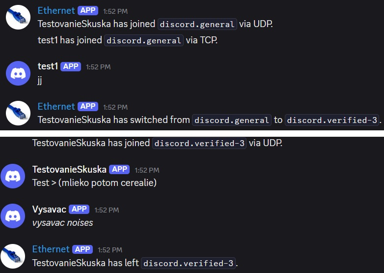
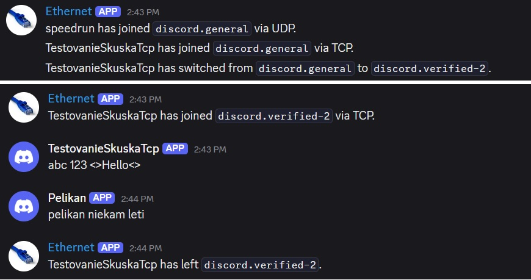

  
    
      
  # `IPK25-CHAT`        
 ## Dokumentácia k 2. úlohe do IPK 2024/2025        
 **Autor:** Jakub Fiľo - xfiloja00        
        
### 1. Teória k Projektu        
 * TCP (Transmission Control Protocol)        
Je to protokol transportnej vrstvy, ktorý umožnuje spolahlive pripojenie k cielovím zariadeniam. Ako prvé nadviaže spojenie pomocou **three-way handshake** kde sa overí pripojenie a až potom posiela dáta. Dáta mozu byt rozdelene do segmentov kvôli velkosti posielanych dat. Protokol TCP vykonova kontrolu aby zarucil ze sa packety nestratia, ku kazdemu packetu pridarí poradové cislo, ktore hovori prijemcovi ake packety mu prichadzaju alebo sa stratili, ak sa packet strati, to znamena ze odosielatel nedostane **ACK** (**acknowledgement**)- správu tak packet pošle znova. Prijemca tiez podla poradovych čisiel vie zostavit data podla poradia.        
 * UDP (User Datagram Protocol)        
Protokol transportnej vrstvy, označovany ako nespolahlivý, nemá zaruku dorucenia packetov. Pouzivatelia musia rátať s možnými stratami dát pri prenose, nespravnim poradim prichadzajucich packetov alebo prijem moznych duplikátov.        
        
         
        
### 2. Implementácia 
#### Asynchrónne Programovanie
 V nasom projekte vyuzivame asynchronne funkcie aby aplikacia reagovala na vstup od uzivatela aj popri spracovavani správ alebo inej funkcionality. Vyuzívame `async` na oznacenie funkcii, ktoré sa budu vykonávať v tom istom čase na inom vlákne systemu. `await` na asynchronne čakanie procesu/funkcie bez blokovanie ostatnych procesov. Spolu a so spomenutymi funkciami vyuzivame ulohy `Task`, je to objekt, ktory reprezentuje danu operaciu, ktora sa moze aktualne prebiehat a dokonči sa v buducnosti. Tymto sposobom vieme zistit či sa operacia vykonala uspesne alebo s chybou.        
        
V našom projekte máme funkciu `StartClientAsync,` ktorá spustí dve klucove ulohy, ktoré bežia sučasne.  Pre UDP variantu sú to`ReceiveMessagesUdpAsync` a `HandleUserInputUdpAsync.`        
        
 * `ReceiveMessagesUdpAsync`        
 Tato uloha neustale caka na prichod UDP datagramov pomocou uz zmieneneho klucoveho slova `await _socket.ReceiveFromAsync(...).` Počas čakania neblokuje ostatne casti programu. Funkcia sa akoby prebudi iba vtedy ked prídu dáta a žacne ich spracovavat (parsovanie atď.)        
 * `HandleUserInputUdpAsync`        
 Úloha caka asynchronne na vstup od uzivatela z konzoly pomocou `await Task.Run(() => Console.ReadLine(), ...).` Po zadani vstupu uzivatelom sa zavola nasledujuca funkcia na spracovanie obsahu vstupu `ProcessParsedCommandAsync(..).`        
 #### **Synchronizácia dát**     
 Nas program vyuziva viacero asynchronnych uloh, ktore bezia sucasne tak by nastal problem keby pouzivame klasicke premenne, jeden proces by chcel zistit hodnotu zatial co druhy by ju chcel zmenit, to moze sposobit poskodenie premmenej alebo pádu programu.        
Tento problem v nasom programe riesime pomocoou specialnych datovych typov, ktore su specialne upravene aby fungovali v asynchronnych programoch.  Pouzivame:        
        
 * `ConcurrentDictionary<TKey, TValue>`        
 je špeciálny typ slovníka navrhnutý priamo pre situácie, kde k nemu    potrebuje pristupovať viacero úloh (vlákien) naraz. Funguje tak ze si    data interne rozdeli na mensie segmenty a zamyka iba ten segment, s    ktorym prave pracuje.        
         
 * `ConcurrentDictionary<ushort, TaskCompletionSource<bool>>           
   _pendingConfirms` Ukladá informacie o spravach, ktore nas klient dostal **`AUTH`**, **`JOIN`** ... , na ktorych program čaka na  potvrdenie **`CONFIRM`** od servera.        
Kluč  **(ushort):** MessageID správy, ktorú sme my odoslali.        
Hodnota **(TaskCompletionSource<bool>):** Objekt, ktorý reprezentuje čakanie. Jeho úloha `Task` je to, na čo čaká metóda `SendReliableUdpMessageAsync` pomocou `await`. Keď prijímacia metoda`ReceiveMessagesUdpAsync` dostane `CONFIRM` od servera so správnym RefMessageId (ktoré zodpovedá nášmu MessageID), nájde tento `TaskCompletionSource` v slovníku a zavolá `tcs.TrySetResult(true)`, čím signalizuje čakajúcej úlohe, že potvrdenie prišlo.        
         
         
 * `ConcurrentDictionary<ushort,TaskCompletionSource<Parsed...>>        
   _pendingReplies`        
 Ukladá informácie o našich odoslaných správach typu **`AUTH`** a **`JOIN`**, pre ktoré sme už dostali **`CONFIRM`**, ale ešte čakáme na funkčnú odpoveď (**`REPLY`**)  od servera.        
   Kľúč **(ushort):** MessageID našej pôvodnej AUTH alebo JOIN správy.        
Hodnota **(TaskCompletionSource<ParsedServerMessage>):** Objekt reprezentujúci čakanie. Metóda `SendRequestAndWaitForReplyAsync` naň čaká pomocou `await tcs.Task`. Keď prijímacia metóda dostane a spracuje **`REPLY`** správu, nájde podľa `RefMessageId` v **`REPLY`** správe tento `TaskCompletionSource` a zavolá `tcs.TrySetResult(parsedReply)`, čím odovzdá spracovanú odpoveď čakajúcej úlohe.        
        
        
 * `ConcurrentDictionary<ushort, byte> _processedIncomingMessageIds` Ukladá `MessageID` správ, ktoré prišli od servera (**`MSG`**, **`REPLY`**, **`ERR`**, **`BYE`**) a ktoré sme už úspešne spracovali, aby sme zabránili opätovnému spracovaniu duplikátov.        
Kľúč **(ushort):**  **`MessageID`** správy prijatej od servera.        
Hodnota **(byte):** Len placeholder. Používame ju len preto, že **`ConcurrentDictionary`** potrebuje nejakú hodnotu. Používame byte, lebo zaberá najmenej miesta v pamäti.        
        
#### **Signalizácia ukončenia asynchronnych operacií** 
Pri asynchrónnych operáciách potrebujeme spôsob, ako ich predčasne ukončiť, napr. ak používateľ stlačí Ctrl+D. Na toto využivame mechanizmus Cancellation Token. Vytvoríme objekt **`CancellationTokenSource`**, ktorý vie signalizovať metódu na zrušenie. Jeho Token potom odovzdáme asynchrónnym metódam. Tieto metódy môžu buď pravidelne kontrolovať, či bola požiadavka na zrušenie vydaná, alebo automaticky vyhodia výnimku **`OperationCanceledException`**, keď je zrušenie signalizované. V našom projekte ho využívame takto:        
 *  **Vytvorenie Tokenu:** Na začiatku vytvoríme `_cts = new CancellationTokenSource()`.        
            
 *  **Odovzdanie Tokenu:**  `_cts.Token` odovzdáme hlavným asynchrónnym metódam `ReceiveMessagesUdpAsync` a `HandleUserInputUdpAsync`. Token sa tiež využivame ďalej v `Task.Delay` v rámci timeoutu, alebo v metóde`SendReliableUdpMessageAsync`.        
            
 *  **Signalizácia:** Keď chceme program ukončiť (napr. v handler pre Ctrl+C alebo keď prijme **`BYE`**/**`ERR`** od servera), zavoláme `_cts.Cancel()`.        
            
 *  **Reakcia:** * Cykly while `(!cancellationToken.IsCancellationRequested)` v `ReceiveMessagesUdpAsync` a `HandleUserInputUdpAsync` sa ukončia.        
            
 * Volania `await` metód, ktoré podporujú `CancellationToken` (ako `_socket.ReceiveFromAsync` alebo `Task.Delay`), vyhodia `OperationCanceledException`, ktorú môžeme zachytiť a vykonať čistenie.        
                
 * V metóde `CancelAllPendingOperations` prejdeme cez `_pendingConfirms` a `_pendingReplies` a zavoláme `TrySetCanceled()` na všetkých čakajúcich `TaskCompletionSource`, aby sme explicitne zrušili úlohy čakajúce na **`CONFIRM`** alebo **`REPLY`**.        
                
 *  **Čistenie:** Po signalizácii zrušenia a dobehnutí úloh sa priamo v `InitiateShutdownAsync` vykoná čistenie zdrojov (`OwnDispose`).        
        
#### Časovač 
Pri komunikácii, kde odpoveď nie je zaručená ako je protokol `IPK25-CHAT`, potrebujeme mechanizmus, ktorý nám povie, kedy už nemá zmysel ďalej čakať. Časovač spustíme po odoslaní správy a ak odpoveď (napr. **`CONFIRM`**) nepríde do stanoveného limitu, časovač vyprší a my môžeme vykonať nasledujucu akciu. V našom projekte namiesto klasických Timer tried využívame schopnosti async/await:        
        
 *   **Čakanie na Funkčnú Odpoveď (`SendRequestAndWaitForReplyAsync`):** * Podobne, po úspešnom prijatí CONFIRM pre AUTH alebo JOIN, vytvoríme `TaskCompletionSource<ParsedServerMessage>` (`replyTcs`) a pridáme ho do `_pendingReplies`.        
                
 * Použijeme `await Task.WhenAny(replyTcs.Task, Task.Delay(ReplyTimeoutMilliseconds, linkedCts.Token))` na čakanie buď na príchod REPLY správy (signalizované cez `replyTcs.TrySetResult(...)`) alebo na vypršanie dlhšieho timeoutu pre **`REPLY`**.        
                
 * Podľa toho, ktorá úloha skončí prvá, program buď spracuje prijatú **`REPLY`**, alebo ohlási chybu timeoutu.        
        
#### **UML Diagram programu**        
 Tento diagram tried ukazuje strukturu naseho programu. Neukazuje niektore detailne informace kvole kvalite citatelnosti a výzoru.        
Hlavna trieda je `Program` sluzi ako prvy vstupny bod do celej funkcionality programu. Na zaklade transportneho protokolu `TCP` alebo `UDP` sa vytvorí instancia prislusnej triedy (`TcpChatClient` alebo `UdpChatClient`). Obidve instancie vyuzivaju triedu `UserInputParser` na spracovanie prikazov od uzivatela.      
Po vytvoreni instancii danej triedy sa zacina asynchronny proces podla zvoleneho protokolu kde sa nadviaze pripadne spojenie so serverom (prípad `TCP`)      
        
        
      
####  TCP - Implementácia 
Komunikacia so serverom cez protokol TCP zacina v metóde `StartClientAsync` kde ako prvé nadviaze spojenie s serverom pomocou `_socket.ConnectAsync` kde prebehne `three-way handshake`, po uspesnom pripojeni sa program rozdeluje na dve hlavne asynchronne ulohy `Task`    
    
 * `ReceiveMessagesAsync` - Čita data prichadzajucu zo serveroveho socketu.    
 * `HandleUserInputAsync` - Číta vstup od používateľa zo štandardného vstupu.    
    
Metoda `StartClientAsync` neustala caka kym neskonci aspon jedno z tychto uloh pomocou `await Task.WhenAny(...)`. Pri volaní tychto dvoch hlavnych funkcii vyuzivame `CancellationTokenSource _cts`, ktory nam pomaha rusit vykonavanie roznych úloh na zaklade signalizacie počas behu komunikacie    
    
**Príjem a Spracovanie Správ zo Servera:**    
 `ReceiveMessagesAsync` číta bajty do bufferu a pridáva ich k reťazcu `_receiveMessage`. `ProcessReceivedBufferAsync` potom hľadá kompletné správy ohraničené `\r\n`, extrahuje ich a nechá ich spracovať metóde `ProcessServerMessageAsync`. Tá parsuje správu pomocou metody `ParseServerMessage` a reaguje podľa typu a aktuálneho stavu v programe (`_currentState`). Správy **`ERR`** a **`BYE`** vždy spustia ukončenie programu cez metodu `InitiateShutdownAsync`. Ostatné správy sa spracujú podľa FSM.    
    
**Používateľský Vstup a Odosielanie Správ:**    
 `HandleUserInputAsync` číta uzivatelov vstup. `UserInputParser` rozlíši príkazy  (`/auth, /join, /rename, /help`) od správ a overí, či dana sa akcia moze vykonat v aktualnom stave programu(`_currentState`). Ak je platná, `ProcessParsedUserInputAsync` ju naformátuje pre TCP a vloží `\r\n` na koniec a pošle pomocou `SendMessageToServerAsync(...)`.    
    
**Posielanie pŕikazov:**    
 Pre príkazy ako `/auth, /join`, ktoré očakávajú  spravu **`REPLY`**od servera na zmenu stavu, klient pred odoslaním správy:    
    
1. Nastaví stav (`_currentState`) na prechodový (`Authenticating/Joining`).    
        
2. Zablokuje ďalší vstup uzivatelovi pomocou (`_waitForReply.Reset()`).    
        
3. Spustí časovač (`StartReplyTimeout`) na 5s čakania na odpoved **`REPLY`**.      
    Prijatím **`REPLY`** (`HandleReply`) sa časovač zruší, stav aktualizuje podľa obsahu správy (OK/NOK) a vstup odblokuje vstup uzivatelovi (`_waitForReply.Set()`). Ak timeout vyprší, spustí sa chyba a ukončenie programu.    
        
    
**Ukončenie a Uvoľnenie Zdrojov:**    
 Ukončenie spustené uzivatelom (Ctrl+C/D), serverom (**`BYE/ERR`**) alebo chybou spracuje metóda `InitiateShutdownAsync`. Tá najprv zruší všetky úlohy cez token `_cts.Cancel()`. Podla aktualneho stavu a dovodu ukoncenia programu sa pokúsi poslať serveru spravu **`BYE`**. Nasledovne uvoľnenie socketu a ostatnych zdrojov robí metodu `OwnDispose`, ktorá sa snazi zatvorit spojenia pred uvoľnením.    
    
    
    
#### UDP(`IPK25-CHAT`) - Implementácia    
 V UDP variante staviame náš **IPK25-CHAT** protokol je postavený na protokole **UDP**. To nás núti si základné funkcie ako doručenie, poradie a jedinečnosť správ vytvorit a nasledne manažovať  manuále na rozdiel od **`TCP`**, kde to rieši operačny system za nás.    
    
Spojenie začína v `StartClientAsync`, kde vytvoríme UDP socket a nastavime ľubovoľný lokálny port `_socket.Bind(new IPEndPoint(IPAddress.Any, 0))` aby sme mohli prijímať dáta. Počiatočné správy `AUTH` posielame na známy serverový port 4567.    
    
Podobne ako pri TCP, program sa delí na dve asynchrónne úlohy (Task) riadené cez token `_cts`:    
    
-   `ReceiveMessagesUdpAsync` - Prijíma UDP datagramy zo servera.    
-   `HandleUserInputUdpAsync` - Číta vstup od používateľa.    
        
Následne `StartClientAsync` čaká na ukončenie jednej z nich pomocou await `Task.WhenAny()`.    
    
**Prijímanie Správ**    
 `ReceiveMessagesUdpAsync` neustále prijíma celé UDP datagramy pomocou `ReceiveFromAsync`. Táto metóda nám okrem dát vráti aj koncovy bod siete odosielateľa, ten obsahuje port servera . Tento port je dost dolezity, pretože server po prvej správe (**`AUTH`**) posiela odpovede z iného, dynamickeho portu. Nasa metóda `HandleDynamicPortUpdate` po prijatí prvej správy od servera aktualizuje náš cieľový serverový port ulozeny v `_currentServerEndPoint` na tento dynamický port, kam od toho momentu budeme posielat všetky ďalšie správy.    
    
- Pocas prijimania dat ak nasa metoda dosane akúkoľvek inú správu než CONFIRM, tak volame metodu `SendConfirmationAsync` a posielame serveru späť **`CONFIRM`** datagram s `MessageID` podla prijatej správy.    
        
- Ak dostaneme a spracujeme **CONFIRM** datagram, neposielame **`CONFIRM`** na spravu   **`CONFIRM`**. Namiesto toho metóda `HandleIncomingConfirm` vyhľadá v slovníku `_pendingConfirms` čakajúcu úlohu pre správu s daným `Ref_MessageID` a signalizuje, že potvrdenie dorazilo.    
        
Spracovanie prijatých správ zahŕňa parsovanie binárneho formátu správy (Typ, ID, reťazce ukončené nulou) a reagovanie podľa typu. Pre spravne poradie bitov pouzivame metodu od triedy `IPAddress` `NetworkToHostOrder()` a na posielanie `HostToNetworkOrder()`.  Pre **`MSG`** správy navyše používame slovník `_processedIncomingMessageIds` na detekciu a ignorovanie duplicitných správ.     
    
**Užívateľský Vstup a Odosielanie Správ**    
 `HandleUserInputUdpAsync` číta vstup a kontroluje platnosť akcie v aktuálnom stave `_currentState` ale najskor `UserInputParser` zparsuje vstup.    
    
`ProcessParsedUserInputAsync` formátuje binárne UDP datagramy pre odoslanie pomocou nasej triedy`UdpMessageFormat`. Spoľahlivosti pri odosielaní dosahujeme tymto sposobom:    
    
- Každá odoslaná správa dostane unikátne `MessageID` a nasledne pripocitavame premenneu , ktora sluzi ako počitaldo odoslanych sprav `_nextMessageId++`.    
        
- Pre správy vyžadujúce potvrdenie sa volá metoda  `SendReliableUdpMessageAsync()`. Táto metóda posiela datagram opakovane (až `MaxRetries` krát, s pomocou timeou `ConfirmationTimeoutMilliseconds` medzi pokusmi odoslania), kým nedostane **`CONFIRM`** od servera s odpovedajúcim **`MessageID`** čo sa signalizuje cez `_pendingConfirms`). Ak sa potvrdenie nedostavi tak povazujeme správu za stratenú.    
        
- Pre správy vyžadujúce odpoveď **`REPLY`** ako su **`AUTH,JOIN`** sa volá metoda `SendRequestAndWaitForReplyAsync`. Táto metóda najprv pošle požiadavku (čaká na **`CONFIRM`**) pomocou `SendReliableUdpMessageAsync`. Potom čaká na príchod **`REPLY`** so správnym **`Ref_MessageID`** v slovníku `_pendingReplies`. Kým čaká na **`REPLY`**, neblokuje sa užívateľský vstup ako pri TCP protokole, iba sa čaká na signál príchodu odpovede.    
        
-   `ParseAndHandleReply` prijme `REPLY`, zparsuje ho a signáluje danú čakajúcu úlohu v `_pendingReplies` na základe `Ref_MessageID`. Metóda `ProcessFunctionalReply` následne spracuje výsledok odpovede (OK/NOK) a zmení stav klienta `_currentState` na zaklade aktualneho stavu (napr. z **`Authenticating`** na **`Joined`** po úspešnom **`AUTH`**).    
        
    
**Riadené Ukončenie a Uvoľnenie Zdrojov:**    
 `InitiateShutdownAsync` spúšťa ukončenie. Zruší hlavné úlohy pomocou signalizacie `_cts.Cancel()`. Ak je ukončenie programu vyziadane užívateľom, posnazi sa poslať bez čakania na `CONFIRM` správu `BYE` na aktuálny serverový koncovy bod siete `IPEndPoint`.    
    
Na rozdiel od TCP, UDP klient musí pri ukončení explicitne zrušiť všetky čakajúce operácie pomocou metody `CancelAllPendingOperations`, ktoré čakajú na potvrdenia ako napr.`_pendingConfirms` alebo odpovede `_pendingReplies`, aby sa neblokovalo ukončenie. `OwnDispose` nakoniec zatvorí `UDP` socket.    
    
    
    
    
        
  ### Spustenie programu   
 ### Testovanie Testovanie programu prebieha na virtuálnom stroji s operačným systémom **Ubuntu 24.04 LTS (amd64)**.  
  
Na analýzu sieťovej komunikácie používame nástroj **Wireshark**. Pre správnu interpretáciu paketov IPK25-CHAT protokolu je nainštalovaný a aktivovaný **vlastný Lua dissector** pre tento protokol, ktorý je súčasťou zdrojových materiálov k projektu.  
  
Z bezpečnostných dôvodov budú v rámci popisu a obsahu testov vynechané heslá použité pri autentifikácii (secret).  
    
####  Testovanie klienta  
  
V rámci testovania komunikácie s referenčným serverom IPK25-CHAT, poskytnutým školou na adrese `anton5.fit.vutbr.cz:4567`, overíme funkcionalitu klienta pre variantu `IPK25-CHAT`. Testy zahŕňajú postupnosť používateľských vstupov, simulujúcich bežnú interakciu v chatovacej aplikácii.  
  
Správnosť implementácie protokolu a komunikácie budeme vizuálne overovať analýzou sieťového prenosu pomocou nástroja Wireshark a nasledne vysledku v aplikacii Discord.  
  
#### Test 1: IPK25-CHAT  UDP varianta  
  
Tento test overuje funkčnosť klienta pri komunikácii cez UDP protokol, vrátane mechanizmov aplikačnej spoľahlivosti (potvrdenia, retransmisie) a správy dynamického serverového portu.  
**Spustenie klienta:**  
  
 ./ipk25chat-client -t udp -s anton5.fit.vutbr.cz  **Sekvencia používateľských vstupov (stdin):**  
  
Postupne zadávame nasledovné príkazy a chatové správy (výpis obsahuje aj očakávanú alebo ukážkovú serverovú odpoveď pre kontext):  
```  
/auth xfiloja00 secret TestovanieSkuska  
# Očakávaná odpoved servera: Authentication successful.  
# Očakávaná MSG od servera: TestovanieSkuska has joined discord.general via UDP.  
  
/join discord.verified-3  
# Očakávaná odpoveď servera: Action Success: Join success.  
# Očakávaná MSG od servera: TestovanieSkuska has joined discord.verified-3 via UDP.  
  
Test > (mlieko potom cerealie)  
# Po odoslaní správy očakávame lokálnu informáciu o úspešnom CONFIRM od servera  
  
/rename Vysavac  
# Toto je lokálny príkaz, nevypisuje serverovú odpoveď. Meno pre budúce správy by sa zmení.  
  
*vysavac noises*  
# Očakávame odoslanie MSG so zmeneným DisplayName 'Vysavac'.  
```  
Používateľ ukončí vstup sekvenciou CTRL + D, ktorá signalizuje koniec štandardného vstupu. Klient by mal následne iniciovať riadené ukončenie spojenia (pokúsi poslať BYE správu).  
                         
      
      
      
   
**Analýza a Výsledky:**  
  
Počas behu klienta a po jeho ukončení sme analyzovali zachytený sieťový prenos vo Wiresharku.  
  
-   **Wireshark:** (Priložený obrázok img/wiresharkUdp1.jpg)  

- Na zachytávke vidíme výmenu UDP paketov.  
          
  - Je pozorovateľná počiatočná komunikácia s portom 4567 a následný prechod na komunikáciu s dynamickým serverovým portom (v ukážke 36396).  
          
  - Pre každú odoslanú správu (AUTH, JOIN, MSG) vidíme, že klient ju posiela a server odpovedá CONFIRM. Pre AUTH a JOIN následne prichádza aj REPLY na dynamickom porte. Pre MSG prichádza potvrdenie CONFIRM.  
          
  
          
-   **Výsledok na Discorde:** (Priložený obrázok img/discordUdp1.jpg)  
      
    - V channele discord.verified-3 vidíme, že klient sa úspešne pripojil (zobrazený JOIN serverovou správou).  
          
    - Odoslané správy `Test > (mlieko potom cerealie)` a `*vysavac noises*` sa zobrazili v chate s korektným DisplayName, Kde pôvodne "TestovanieSkuska" pre prvú správu a zmeneným "Vysavac" pre druhú. Správu `*vysavac noises*` v Discorde mozeme vidiet napisanú kurzivou, Discord uvazuje vstup medzi `*` ako formatovanie na kurzívu  
      
Počas testovania sme mohli vidiet aj vstup od ineho uzivatela s DisplayName test1, ktorý nám posielal spravy počas našho testu.         
  
Tento test potvrdzuje implementáciu nasho protokolu, autentifikácie, pripojenia do kanála, odosielania správ, zmeny lokálneho displayName a funkčnosť aplikačnej spoľahlivosti (CONFIRM mechanizmu a spracovania REPLY) pre UDP variant IPK25-CHAT protokolu.  
  
#### Test 2: TCP varianta  
  
Tento test overuje funkčnosť klienta pri komunikácii cez TCP protokol. Zameriava sa na správne nadviazanie pripojenia a správu TCP spojenia, parsovanie textového protokolu a riadené ukončenie spojenia.  
  
**Spustenie klienta:**  
  
 ./ipk25chat-client -t tcp -s anton5.fit.vutbr.cz  **Sekvencia používateľských vstupov (stdin):**  
  
Postupne zadávame nasledovné príkazy a chatové správy (výpis obsahuje aj očakávanú alebo ukážkovú serverovú odpoveď pre kontext):  
```  
/auth xfiloja00 secret TestovanieSkuskaTcp  
# Očakávaná odpoved servera: Authentication successful.  
# Očakávaná MSG od servera: TestovanieSkuska has joined discord.general via TCP.  
  
/join discord.verified-2  
# Očakávaná odpoveď servera: Channel discord.verified-2 succesfully joined.  
# Očakávaná MSG od servera: Server: TestovanieSkuskaTcp has joined discord.verified-2 via TCP.  
  
abc 123 <>Hello<>  
# Po odoslaní správy nečakame na odpoved lebo sme spojeni cez protokol TCP, ktory je stream.  
  
/rename Pelikan  
# Toto je lokálny príkaz, nevypisuje serverovú odpoveď. Meno pre budúce správy by sa zmení.  
  
pelikan niekam leti  
# Očakávame odoslanie MSG so zmeneným DisplayName 'Pelikan'.  
```  
Používateľ ukončí program stlačením klávesovej skratky `CTRL + C`. Klient zachytí tento signál a inicializuje riadené ukončenie spojenia `InitiateShutdownAsync()`, čo zahŕňa odoslanie **`BYE`** správy serveru a následné riadené zatvorenie TCP socketu.  
  
      
   
       

**Analýza a Výsledky:**  
  
Počas behu klienta a po jeho ukončení sme analyzovali zachytený sieťový prenos vo Wiresharku a overili stav na Discorde.  
  
-   **Wireshark:** (Priložený obrázok img/WiresharkTcp1.jpg)  
      
    - Na zachytávke vidíme výmenu TCP paketov na porte 4567.  
                    
    - Vidíme požiadavky klienta (AUTH, JOIN, MSG) a textové odpovede servera (REPLY OK IS ..., MSG FROM Server IS ..., MSG FROM ... IS ...).  
          
    - Na konci komunikácie vidíme, že klient odošle správu BYE FROM Pelikan a následne dôjde k riadenému ukončeniu TCP spojenia.  
          
-   **Výsledok na Discorde:** (Priložený obrázok img/DiscordTcp1.jpg)  
      
    - V channele discord.general vidíme, že klient sa úspešne pripojil a zmenil kanál na discord.verified-2.  
          
    - Odoslané správy `abc 123 <>Hello<>` a `pelikan niekam leti` sa zobrazili v chate s korektným DisplayName pôvodným `TestovanieSkuskaTcp` pre prvú správu a zmeneným `Pelikan` pre druhú).  
          
  
Tento test potvrdzuje správnu implementáciu TCP variantu IPK25-CHAT protokolu, vrátane nadviazania TCP spojenia, parsovania a formátovania textových správ, spracovania príkazov a riadeného ukončenia spojenia iniciovaného klientom.  


### Test 2:  Netcat + UDP
Tento test slúži na overenie správneho formátovania **binárnych správ** UDP variantu IPK25-CHAT protokolu a implementácie **mechanizmov aplikačnej spoľahlivosti** (potvrdenia CONFIRM, spracovanie REPLY) a správneho používania MessageID. Test sa vykonáva na lokálnom stroji pomocou nástroja netcat simulujúceho pseudo-server. Na rozdiel od testovania s referenčným serverom, dynamické porty servera nebudú plne simulované – namiesto toho Netcat v jednom termináli počúva na známom porte a v druhom sa používa na odosielanie odpovedí klientovi na jeho konkrétny dynamický port.

Na toto testovanie potrebujeme tri otvorené terminály:

 1. **Terminál A (Netcat Pseudo-server Listener):**

 Tu spustíme Netcat v režime počúvania na porte 4567 pre IPv4 UDP datagramy. Jeho úlohou je prijímať prvé datagramy od klienta, zobraziť **zdrojový IP a port klienta** (to bude náš cieľ pre odpovede) a prijímať všetky ďalšie datagramy od klienta. Nič sám odosielať nebude.

    nc -4 -u -l -v 127.0.0.1 4567

 2. **Terminál B (IPK25-CHAT Klient):**

 Tu beží náš klient program. Zadáme mu príkazy, on ich spracuje, naformátuje binárne UDP správy a odošle ich. Tiež tu klient prijíma binárne odpovede zo servera (simulovaného Netcatom v Termináli C) a zobrazuje výstupy.

    ./ipk25chat-client -t udp -s 127.0.0.1

    

 1. **Terminál C (Netcat Manual Sender):**

 Tento terminál používame na manuálne odosielanie ručne vytvorených binárnych datagramov (CONFIRM, REPLY, MSG atď.) klientovi. Každý príkaz `nc -u ... < file.bin` sa spustí, pošle jeden datagram a skončí. Nebude bežať nepretržite ako server.

**Priebeh Testu:**
Po spustení Netcat listenera (Terminál A) a klienta (Terminál B), začíname interakciu zadávaním príkazov v Termináli B a simulovaním odpovedí v Termináli C. V tomto teste používame testovacie meno TestDisplayUdp.

 2. **Klient posiela AUTH:** V Termináli B zadáme /auth testuser testsecret TestDisplayUdp. Klient naformátuje binárny AUTH datagram (Typ 0x02, ID 0) a pošle ho na 127.0.0.1:4567. V logoch klienta vidíme "Sending AUTH (ID: 0) to 127.0.0.1:4567".

 3. **Netcat Listener prijíma AUTH a zistí port klienta:** V Termináli A Netcat prijme tento datagram a zobrazí jeho zdroj, čo je dynamický port klienta. V našom prípade to bol port 56266.

	```Connection received on localhost 56266```
	
	**Kľúčové: Dynamický port klienta pre tento test je 56266.** Všetky naše manuálne odpovede z Terminálu C budeme posielať na 127.0.0.1:56266.

 4. **Manuálne odoslanie CONFIRM na AUTH:** V Termináli C vytvoríme binárny súbor s potvrdením (Typ 0x00, Ref_MessageID 0) a pošleme ho klientovi na port 56266.
	```
	echo -n -e '\x00\x00\x00' > confirm_auth.bin
	nc -4 -u -v 127.0.0.1 56266 < confirm_auth.bin
	```
	V logoch klienta (Terminál B) vidíme, že potvrdzuje príjem CONFIRM pre MessageID 0.

 5. **Manuálne odoslanie REPLY OK na AUTH:** V Termináli C vytvoríme binárny súbor s odpoveďou (Typ 0x01, ID 0, Result OK 0x01,
    Ref_MessageID 0, Content "OK" + null) a pošleme ho klientovi na port
    56266.

	```
	echo -n -e '\x01\x00\x00\x01\x00\x00OK\x00' > reply_auth_ok.bin
	nc -4 -u -v 127.0.0.1 56266 < reply_auth_ok.bin
	```
	V logoch klienta vidíme spracovanie REPLY a výstup Action Success: OK. Klient prejde do stavu Joined (v default kanáli).

 6. **Klient posiela JOIN:** V Termináli B zadáme /join test-channel. Klient naformátuje binárny JOIN datagram (Typ 0x03, ID 1) a pošle ho na serverov port, ktorý si zapamätal z prvej serverovej odpovede (v     našom prípade 43970). V logoch klienta vidíme "Sending JOIN (ID: 1)  to 127.0.0.1:43970".

 7. **Netcat Listener prijíma JOIN:** V Termináli A Netcat opäť prijme datagram (JOIN) z portu 56266.

    
 8. **Manuálne odoslanie CONFIRM na JOIN:** V Termináli C vytvoríme CONFIRM (Typ 0x00, Ref_MessageID 1) a pošleme ho klientovi (port    56266).
	```
		echo -n -e '\x00\x00\x01' > confirm_join.bin
		nc -4 -u -v 127.0.0.1 56266 < confirm_join.bin
	```
	V logoch klienta vidíme príjem a spracovanie CONFIRM pre MessageID 1.

 9. **Manuálne odoslanie REPLY OK na JOIN:** V Termináli C vytvoríme REPLY OK (Typ 0x01, ID 1, Result OK 0x01, Ref_MessageID 1, Content "Join success" + null) a pošleme ho klientovi (port 56266).
	  ```
	echo -n -e '\x01\x01\x01\x00\x01Join success\x00' > reply_join_ok.bin # Oprava: ID 1, RefID 1
	nc -4 -u -v 127.0.0.1 56266 < reply_join_ok.bin
	```
	V logoch klienta vidíme spracovanie REPLY a výstup Action Success: Join success. Klient prejde do stavu Joined v kanáli 'test-channel'.

 10. **Klient posiela MSG:** V Termináli B zadáme Toto je moja prva udp sprava. Klient naformátuje binárny MSG datagram (Typ 0x04, ID 2) a pošle ho na serverov port 43970. V logoch klienta vidíme "Sending MSG (ID: 2) to 127.0.0.1:43970".

 11. **Netcat Listener prijíma MSG:** V Termináli A Netcat prijme MSG z portu 56266.
 12. **Manuálne odoslanie CONFIRM na MSG:** V Termináli C vytvoríme CONFIRM (Typ 0x00, Ref_MessageID 2) a pošleme ho klientovi (port 56266).

		```
		echo -n -e '\x00\x00\x02' > confirm_msg1.bin
		nc -4 -u -v 127.0.0.1 56266 < confirm_msg1.bin
		```

	V logoch klienta vidíme príjem a spracovanie CONFIRM pre MessageID 2, potvrdzujúce úspešné odoslanie.

 13. **Manuálne odoslanie prichádzajúcej MSG:** V Termináli C vytvoríme binárnu MSG správu (Typ 0x04, ID 1 - iné ID ako klient, DisplayName "InyUser" + null, Content "Ahoj" + null) a pošleme ju klientovi (port 56266).
		```
		echo -n -e '\x04\x00\x01InyUser\x00Ahoj\x00' > msg_from_other.bin
		nc -4 -u -v 127.0.0.1 56266 < msg_from_other.bin
		```
		Klient v Termináli B prijme MSG, pošle späť CONFIRM (uvidíme v Termináli A) a vypíše InyUser: Ahoj.

 14. **Ukončenie klienta:** V Termináli B stlačíme CTRL + D (alebo CTRL + C). Klient iniciuje riadené ukončenie, pokúsi sa poslať BYE (Typ 0xFF, ID 3) na serverov port 43970. V logoch klienta vidíme "Initiating graceful shutdown..." a pokus o odoslanie BYE.

 15. **Netcat Listener prijíma BYE:** V Termináli A Netcat prijme BYE z portu 56266.
 16. **Manuálne odoslanie CONFIRM na BYE:** V Termináli C vytvoríme CONFIRM (Typ 0x00, Ref_MessageID 3) a pošleme ho klientovi (port 56266).
		```
		echo -n -e '\x00\x00\x03' > confirm_bye.bin
		nc -4 -u -v 127.0.0.1 56266 < confirm_bye.bin
		```
	V logoch klienta vidíme príjem a spracovanie CONFIRM pre MessageID 3, klient ukončí beh.

**Pozorovaná Zmena Portov a Handling Klientom:**

V logoch klienta (**Terminál B**) je vidieť, že prichádzajúce pakety od servera (pseudo-servera simulovaného Netcatom) neprichádzajú stále z jedného portu. Po prijatí prvej správy **`(AUTH CONFIRM`** z portu 35338) klient detegoval túto zmenu oproti pôvodnému cieľu (4567) a aktualizoval si serverový `IPEndPoint` na 127.0.0.1:35338. Následné správy od klienta (**`JOIN, MSG, BYE`**) posielal na tento port (43970 v logoch po **`AUTH REPLY`**). Avšak odpovede na tieto správy (**`CONFIRM`** na **`JOIN/MSG/BYE, REPLY`** na **`JOIN`**) prichádzali zakaždým z iného dynamického portu (54878, 41553, 39103, 46158, 41007).

Napriek tomuto netradičnému správaniu servera (kedy sa zdrojový port odpovedí menil), náš klient si s tým úspešne poradil. Vďaka svojej implementácii metód spracujúcich prichádzajúce datagramy dokázal detegovať, že prichádzajúce pakety pochádzajú z iného `IPEndPortu`, než s akým momentálne komunikuje, a dynamicky aktualizovať cieľový serverový port (`_currentServerEndPoint`) pre odosielanie svojich budúcich správ. Tým sa zabezpečila neprerušovaná komunikácia a správne smerovanie odosielaných správ, čo je v súlade s požiadavkou na handling dynamických portov.

**Záver Testu:**

Test s Netcatom úspešne potvrdil správnu implementáciu nízkoúrovňových aspektov **UDP** variantu IPK25-CHAT protokolu. Overila sa schopnosť klienta formátovať binárne správy, prijímať a parsovať rôzne typy serverových binárnych správ, správne používať `MessageID` pre aplikačné potvrdenia a odpovede a dynamicky manažovať serverový `IPEndPoint` na základe prichádzajúcich paketov.

**TcpDump** 

    17:33:21.199877 IP 127.0.0.1.56266 > 127.0.0.1.4567:  wb-114! (invalid)
    	0x0000:  4500 0042 db37 4000 4011 6171 7f00 0001  E..B.7@.@.aq....
    	0x0010:  7f00 0001 dbca 11d7 002e fe41 0200 0074  ...........A...t
    	0x0020:  6573 7475 7365 7200 5465 7374 4469 7370  estuser.TestDisp
    	0x0030:  6c61 7955 6470 0074 6573 7473 6563 7265  layUdp.testsecre
    	0x0040:  7400                                     t.
    17:33:32.637423 IP 127.0.0.1.35338 > 127.0.0.1.56266: UDP, length 3
    	0x0000:  4500 001f 11f9 4000 4011 2ad3 7f00 0001  E.....@.@.*.....
    	0x0010:  7f00 0001 8a0a dbca 000b fe1e 0000 00    ...............
    17:33:41.074840 IP 127.0.0.1.43970 > 127.0.0.1.56266: UDP, length 9
    	0x0000:  4500 0025 051b 4000 4011 37ab 7f00 0001  E..%..@.@.7.....
    	0x0010:  7f00 0001 abc2 dbca 0011 fe24 0100 0001  ...........$....
    	0x0020:  0000 4f4b 00                             ..OK.
    17:33:41.095684 IP 127.0.0.1.56266 > 127.0.0.1.43970: UDP, length 3
    	0x0000:  4500 001f 2639 4000 4011 1693 7f00 0001  E...&9@.@.......
    	0x0010:  7f00 0001 dbca abc2 000b fe1e 0000 00    ...............
    17:33:45.066728 IP 127.0.0.1.56266 > 127.0.0.1.43970: UDP, length 31
    	0x0000:  4500 003b 2a7d 4000 4011 1233 7f00 0001  E..;*}@.@..3....
    	0x0010:  7f00 0001 dbca abc2 0027 fe3a 0300 0174  .........'.:...t
    	0x0020:  6573 742d 6368 616e 6e65 6c00 5465 7374  est-channel.Test
    	0x0030:  4469 7370 6c61 7955 6470 00              DisplayUdp.
    17:33:55.743393 IP 127.0.0.1.54878 > 127.0.0.1.56266: UDP, length 3
    	0x0000:  4500 001f f6c7 4000 4011 4604 7f00 0001  E.....@.@.F.....
    	0x0010:  7f00 0001 d65e dbca 000b fe1e 0000 01    .....^.........
    17:34:04.252635 IP 127.0.0.1.41553 > 127.0.0.1.56266: UDP, length 19
    	0x0000:  4500 002f 5c3d 4000 4011 e07e 7f00 0001  E../\=@.@..~....
    	0x0010:  7f00 0001 a251 dbca 001b fe2e 0100 0101  .....Q..........
    	0x0020:  0001 4a6f 696e 2073 7563 6365 7373 00    ..Join.success.
    17:34:04.253439 IP 127.0.0.1.56266 > 127.0.0.1.41553: UDP, length 3
    	0x0000:  4500 001f 5975 4000 4011 e356 7f00 0001  E...Yu@.@..V....
    	0x0010:  7f00 0001 dbca a251 000b fe1e 0000 01    .......Q.......
    17:34:07.895334 IP 127.0.0.1.56266 > 127.0.0.1.43970: UDP, length 47
    	0x0000:  4500 004b 626e 4000 4011 da31 7f00 0001  E..Kbn@.@..1....
    	0x0010:  7f00 0001 dbca abc2 0037 fe4a 0400 0254  .........7.J...T
    	0x0020:  6573 7444 6973 706c 6179 5564 7000 546f  estDisplayUdp.To
    	0x0030:  746f 206a 6520 6d6f 6a61 2070 7276 6120  to.je.moja.prva.
    	0x0040:  7564 7020 7370 7261 7661 00              udp.sprava.
    17:34:18.118887 IP 127.0.0.1.39103 > 127.0.0.1.56266: UDP, length 3
    	0x0000:  4500 001f 7fd5 4000 4011 bcf6 7f00 0001  E.....@.@.......
    	0x0010:  7f00 0001 98bf dbca 000b fe1e 0000 02    ...............
    17:34:23.489133 IP 127.0.0.1.42527 > 127.0.0.1.4567:  wb-114! (invalid)
    	0x0000:  4500 0042 9a7d 4000 4011 a22b 7f00 0001  E..B.}@.@..+....
    	0x0010:  7f00 0001 a61f 11d7 002e fe41 0200 0074  ...........A...t
    	0x0020:  6573 7475 7365 7200 5465 7374 4469 7370  estuser.TestDisp
    	0x0030:  6c61 7955 6470 0074 6573 7473 6563 7265  layUdp.testsecre
    	0x0040:  7400                                     t.
    17:34:31.631265 IP 127.0.0.1.46158 > 127.0.0.1.56266: UDP, length 16
    	0x0000:  4500 002c 0e57 4000 4011 2e68 7f00 0001  E..,.W@.@..h....
    	0x0010:  7f00 0001 b44e dbca 0018 fe2b 0400 0149  .....N.....+...I
    	0x0020:  6e79 5573 6572 0041 686f 6a00            nyUser.Ahoj.
    17:34:31.634961 IP 127.0.0.1.56266 > 127.0.0.1.46158: UDP, length 3
    	0x0000:  4500 001f 9c81 4000 4011 a04a 7f00 0001  E.....@.@..J....
    	0x0010:  7f00 0001 dbca b44e 000b fe1e 0000 01    .......N.......
    17:34:35.542872 IP 127.0.0.1.56266 > 127.0.0.1.43970: UDP, length 18
    	0x0000:  4500 002e a231 4000 4011 9a8b 7f00 0001  E....1@.@.......
    	0x0010:  7f00 0001 dbca abc2 001a fe2d ff00 0354  ...........-...T
    	0x0020:  6573 7444 6973 706c 6179 5564 7000       estDisplayUdp.
    17:34:44.975972 IP 127.0.0.1.41007 > 127.0.0.1.56266: UDP, length 3
    	0x0000:  4500 001f 8b46 4000 4011 b185 7f00 0001  E....F@.@.......
    	0x0010:  7f00 0001 a02f dbca 000b fe1e 0000 03    ...../.........


  

        
### Bibliografia     
System.Collections.Concurrent.ConcurrentDictionary<TKey,TValue> Class [online]. Microsoft, [cit. 2025-04-19]. Available at: https://learn.microsoft.com/en-us/dotnet/api/system.collections.concurrent.concurrentdictionary-2?view=net-9.0    
 
Task Class [online]. Microsoft, [cit. 2025-04-19]. Available at: https://learn.microsoft.com/en-us/dotnet/api/system.threading.tasks.task?view=net-9.0    

Asynchronous programming - Async Scenarios [online]. Microsoft, [cit. 2025-04-19]. Available at: https://learn.microsoft.com/cs-cz/dotnet/csharp/asynchronous-programming/async-scenarios    

System.Collections.Concurrent.ConcurrentDictionary<TKey,TValue> Class [online]. Microsoft, [cit. 2025-04-19]. Available at: https://learn.microsoft.com/en-us/dotnet/api/system.collections.concurrent.concurrentdictionary-2?view=net-9.0    

TaskCompletionSource<TResult> Class [online]. Microsoft, [cit. 2025-04-19]. Available at: https://learn.microsoft.com/en-us/dotnet/api/system.threading.tasks.taskcompletionsource-1?view=net-9.0    

IPEndPoint Class [online]. Microsoft, [cit. 2025-04-19]. Available at: https://learn.microsoft.com/cs-cz/dotnet/api/system.net.ipendpoint?view=net-9.0    

SmartDraw - Diagramming Made Easy [online]. SmartDraw, [cit. 2025-04-19]. Available at: https://app.smartdraw.comch 2025].    
    
Gemini, Google LLC. Komentovanie kódu. [Online]. Available at: https://gemini.google.com    

Gemini, Google LLC. Ako urobiť korektné ukončenie programu v .NET 9. [Online]. Available at: https://gemini.google.com    

Gemini, Google LLC. Ako pracovať s CancellationTokenSource, aby sa zabezpečilo správne ukončenie programu. [Online]. Available at: https://gemini.google.com    

Gemini, Google LLC. Ako pracovať s CancellationTokenSource pre asynchrónne čakanie. [Online]. Available at: https://gemini.google.com    

Gemini, Google LLC. Ako pracovať s ConcurrentDictionary pre asynchrónne ukladanie údajov. [Online]. Available at: https://gemini.google.com    

Gemini, Google LLC. Ako správne zlikvidovať použité zdroje CancellationTokenSource, ConcurrentDictionary a iné. [Online]. Available at: https://gemini.google.com    

Gemini, Google LLC. Ako používať formátovanie Regex v c# .NET 9 s nastavenými gramatickými pravidlami na kontrolu vstupu. [Online]. Available at: https://gemini.google.com    

Gemini, Google LLC. Ako programovať s Microsoft.Extensions.Logging a ako prepojiť triedy s triedou Logging. [Online]. Available at: https://gemini.google.com

Gemini, Google LLC. Test pogramu na UDP čast programu pomocou netcad a jeho dokumentáciu . [Online]. Available at: https://gemini.google.com
