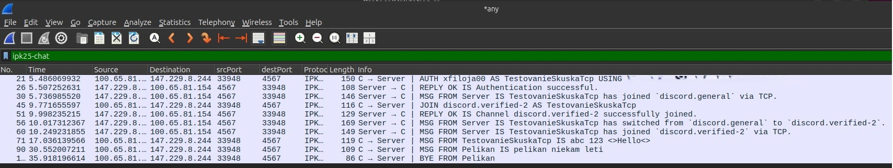

 # `IPK25-CHAT`        
 ### Dokumentácia k 2. úlohe do IPK 2024/2025        
 **Autor:** Jakub Fiľo - xfiloja00        
        
### 1. Teória k Projektu        
 * **TCP (Transmission Control Protocol)**       
Je to protokol transportnej vrstvy, ktorý umožňuje spoľahlivé pripojenie k cieľovým zariadeniam. Ako prvé nadviaže spojenie pomocou three-way handshake, kde sa overí pripojenie a až potom posiela dáta. Dáta môžu byť rozdelené do segmentov kvôli veľkosti posielaných dát. Protokol TCP vykonáva kontrolu, aby zaručil, že sa pakety nestratia. Ku každému paketu pridá poradové číslo, ktoré hovorí príjemcovi, aké pakety mu prichádzajú alebo sa stratili. Ak sa paket stratí, to znamená, že odosielateľ nedostane ACK (acknowledgement) - potvrdzujúcu správu, tak paket pošle znova. Príjemca tiež podľa poradových čísel vie zostaviť dáta podľa poradia.
 * **UDP (User Datagram Protocol)**        
Protokol transportnej vrstvy, označovaný ako nespoľahlivý, nemá záruku doručenia paketov. Používatelia musia rátať s možnými stratami dát pri prenose, nesprávnym poradím prichádzajúcich paketov alebo s prijatím možných duplikátov.
                                            

 *         
                                                     
---
        
### 2. Implementácia 

#### Asynchrónne Programovanie
V našom projekte využívame asynchrónne funkcie, aby aplikácia reagovala na vstup od používateľa aj popri spracovávaní správ alebo inej funkcionality. Využívame async na označenie funkcií, ktoré sa budú vykonávať v tom istom čase na inom vlákne systému. await používame na asynchrónne čakanie procesu/funkcie bez blokovania ostatných procesov. Spolu so spomenutými funkciami využívame úlohy Task. Je to objekt, ktorý reprezentuje danú operáciu, ktorá môže aktuálne prebiehať a dokončí sa v budúcnosti. Týmto spôsobom vieme zistiť, či sa operácia vykonala úspešne alebo s chybou.        
Používame máme funkciu StartClientAsync, ktorá spustí dve kľúčové úlohy, ktoré bežia súčasne. Pre UDP variantu sú to ReceiveMessagesUdpAsync a HandleUserInputUdpAsync.

`ReceiveMessagesUdpAsync`
Táto úloha neustále čaká na príchod UDP datagramov pomocou už zmieneného kľúčového slova await _socket.ReceiveFromAsync(...). Počas čakania neblokuje ostatné časti programu. Funkcia sa akoby prebudí iba vtedy, keď prídu dáta a začne ich spracovávať (parsovanie atď.).

`HandleUserInputUdpAsync`
Úloha čaká asynchrónne na vstup od používateľa z konzoly pomocou await Task.Run(() => Console.ReadLine(), ...). Po zadaní vstupu používateľom sa zavolá nasledujúca funkcia na spracovanie obsahu vstupu ProcessParsedCommandAsync(..).

#### **Synchronizácia dát**     
Náš program využíva viacero asynchrónnych úloh, ktoré bežia súčasne, takže by nastal problém, keby sme používali klasické premenné. Jeden proces by chcel zistiť hodnotu, zatiaľ čo druhý by ju chcel zmeniť, čo môže spôsobiť poškodenie premennej alebo pád programu.

Tento problém v našom programe riešime pomocou špeciálnych dátových typov, ktoré sú špeciálne upravené, aby fungovali v asynchrónnych programoch. Používame:

  * `ConcurrentDictionary<TKey, TValue>`
    Je špeciálny typ slovníka navrhnutý priamo pre situácie, kde k nemu potrebuje pristupovať viacero úloh (vlákien) naraz. Funguje tak, že si dáta interne rozdelí na menšie segmenty a zamyká iba ten segment, s ktorým práve pracuje.

  * `ConcurrentDictionary<ushort, TaskCompletionSource<bool>> _pendingConfirms`
    Ukladá informácie o správach, ktoré náš klient dostal (`AUTH`, `JOIN`...), na ktorých program čaká na potvrdenie (`CONFIRM`) od servera.

      * **Kľúč (ushort):** MessageID správy, ktorú sme my odoslali.
      * **Hodnota (TaskCompletionSource\<bool\>):** Objekt, ktorý reprezentuje čakanie. Jeho úloha `Task` je to, na čo čaká metóda `SendReliableUdpMessageAsync` pomocou `await`. Keď prijímacia metóda `ReceiveMessagesUdpAsync` dostane `CONFIRM` od servera so správnym `RefMessageId` (ktoré zodpovedá nášmu `MessageID`), nájde tento `TaskCompletionSource` v slovníku a zavolá `tcs.TrySetResult(true)`, čím signalizuje čakajúcej úlohe, že potvrdenie prišlo.

  * `ConcurrentDictionary<ushort, TaskCompletionSource<ParsedServerMessage>> _pendingReplies`
    Ukladá informácie o našich odoslaných správach typu `AUTH` a `JOIN`, pre ktoré sme už dostali `CONFIRM`, ale ešte čakáme na funkčnú odpoveď (`REPLY`) od servera.

      * **Kľúč (ushort):** MessageID našej pôvodnej AUTH alebo JOIN správy.
      * **Hodnota (TaskCompletionSource\<ParsedServerMessage\>):** Objekt reprezentujúci čakanie. Metóda `SendRequestAndWaitForReplyAsync` naň čaká pomocou `await tcs.Task`. Keď prijímacia metóda dostane a spracuje `REPLY` správu, nájde podľa `RefMessageId` v `REPLY` správe tento `TaskCompletionSource` a zavolá `tcs.TrySetResult(parsedReply)`, čím odovzdá spracovanú odpoveď čakajúcej úlohe.

  * `ConcurrentDictionary<ushort, byte> _processedIncomingMessageIds`
    Ukladá `MessageID` správ, ktoré prišli od servera (`MSG`, `REPLY`, `ERR`, `BYE`) a ktoré sme už úspešne spracovali, aby sme zabránili opätovnému spracovaniu duplikátov.

      * **Kľúč (ushort):** `MessageID` správy prijatej od servera.
      * **Hodnota (byte):** Len zástupná hodnota. Používame ju len preto, že `ConcurrentDictionary` potrebuje nejakú hodnotu. Používame byte, lebo zaberá najmenej miesta v pamäti.
     
#### **Signalizácia ukončenia asynchrónnych operácií** 

Pri asynchrónnych operáciách potrebujeme spôsob, ako ich predčasne ukončiť, napríklad ak používateľ stlačí Ctrl+D. Na toto využívame mechanizmus `CancellationToken`. Vytvoríme objekt `CancellationTokenSource`, ktorý vie signalizovať metódu na zrušenie. Jeho `Token` potom odovzdáme asynchrónnym metódam. Tieto metódy môžu buď pravidelne kontrolovať, či bola požiadavka na zrušenie vydaná, alebo automaticky vyhodia výnimku `OperationCanceledException`, keď je zrušenie signalizované. V našom projekte ho využívame takto:

* **Vytvorenie Tokenu:** Na začiatku vytvoríme `_cts = new CancellationTokenSource()`.

* **Odovzdanie Tokenu:** `_cts.Token` odovzdáme hlavným asynchrónnym metódam `ReceiveMessagesUdpAsync` a `HandleUserInputUdpAsync`. Token sa tiež využíva ďalej v `Task.Delay` v rámci timeoutu, alebo v metóde `SendReliableUdpMessageAsync`.

* **Signalizácia:** Keď chceme program ukončiť (napr. v handleri pre Ctrl+C alebo keď prijme `BYE`/`ERR` od servera), zavoláme `_cts.Cancel()`.

* **Reakcia:**
    * Cykly `while (!cancellationToken.IsCancellationRequested)` v `ReceiveMessagesUdpAsync` a `HandleUserInputUdpAsync` sa ukončia.
    * Volania `await` metód, ktoré podporujú `CancellationToken` (ako `_socket.ReceiveFromAsync` alebo `Task.Delay`), vyhodia `OperationCanceledException`, ktorú môžeme zachytiť a vykonať čistenie.
    * V metóde `CancelAllPendingOperations` prejdeme cez `_pendingConfirms` a `_pendingReplies` a zavoláme `TrySetCanceled()` na všetkých čakajúcich `TaskCompletionSource`, aby sme explicitne zrušili úlohy čakajúce na `CONFIRM` alebo `REPLY`.

* **Čistenie:** Po signalizácii zrušenia a dobehnutí úloh sa priamo v `InitiateShutdownAsync` vykoná čistenie zdrojov (`OwnDispose`).
   
#### Časovač 

Pri komunikácii, kde odpoveď nie je zaručená, ako je protokol `IPK25-CHAT`, potrebujeme mechanizmus, ktorý nám povie, kedy už nemá zmysel ďalej čakať. Časovač spustíme po odoslaní správy a ak odpoveď (napr. `CONFIRM`) nepríde do stanoveného limitu, časovač vyprší a my môžeme vykonať nasledujúcu akciu. V našom projekte namiesto klasických `Timer` tried využívame schopnosti `async/await`:

* **Čakanie na Funkčnú Odpoveď (`SendRequestAndWaitForReplyAsync`):** Podobne, po úspešnom prijatí `CONFIRM` pre `AUTH` alebo `JOIN`, vytvoríme `TaskCompletionSource<ParsedServerMessage>` (`replyTcs`) a pridáme ho do `_pendingReplies`.

* Použijeme `await Task.WhenAny(replyTcs.Task, Task.Delay(ReplyTimeoutMilliseconds, linkedCts.Token))` na čakanie buď na príchod `REPLY` správy (signalizované cez `replyTcs.TrySetResult(...)`) alebo na vypršanie dlhšieho timeoutu pre `REPLY`.

* Podľa toho, ktorá úloha skončí prvá, program buď spracuje prijatú `REPLY`, alebo ohlási chybu timeoutu.
* 
#### **UML Diagram programu**    

Tento diagram tried ukazuje štruktúru nášho programu. Neukazuje niektoré detailné informácie kvôli čitateľnosti a vzhľadu.

Hlavná trieda je `Program` a slúži ako prvý vstupný bod do celej funkcionality programu. Na základe transportného protokolu (`TCP` alebo `UDP`) sa vytvorí inštancia príslušnej triedy (`TcpChatClient` alebo `UdpChatClient`). Obidve inštancie využívajú triedu `UserInputParser` na spracovanie príkazov od používateľa.

Po vytvorení inštancie danej triedy sa začína asynchrónny proces podľa zvoleného protokolu, kde sa nadviaže prípadné spojenie so serverom (v prípade `TCP`).

        
      
####  TCP - Implementácia 

Komunikácia so serverom cez protokol TCP začína v metóde StartClientAsync, kde ako prvé nadviaže spojenie so serverom pomocou _socket.ConnectAsync, počas ktorého prebehne three-way handshake. Po úspešnom pripojení sa program rozdelí na dve hlavné asynchrónne úlohy (Task):

`ReceiveMessagesAsync` - Číta dáta prichádzajúce zo serverového socketu.

`HandleUserInputAsync` - Číta vstup od používateľa zo štandardného vstupu.

Metóda `StartClientAsync` neustále čaká, kým neskončí aspoň jedna z týchto úloh pomocou `await Task.WhenAny(...)`. Pri volaní týchto dvoch hlavných funkcií využívame `CancellationTokenSource _cts`, ktorý nám pomáha rušiť vykonávanie rôznych úloh na základe signalizácie počas behu komunikácie.

**Príjem a Spracovanie Správ zo Servera:**

`ReceiveMessagesAsync` číta bajty do buffera a pridáva ich k reťazcu _`receiveMessage`. `ProcessReceivedBufferAsync` potom hľadá kompletné správy ohraničené `\r\n`, extrahuje ich a nechá ich spracovať metódou `ProcessServerMessageAsync`. Tá parsuje správu pomocou metódy `ParseServerMessage` a reaguje podľa typu a aktuálneho stavu v programe (`_currentState`). Správy `ERR` a `BYE` vždy spustia ukončenie programu cez metódu `InitiateShutdownAsync`. Ostatné správy sa spracujú podľa FSM (Finite State Machine).

**Používateľský Vstup a Odosielanie Správ:**

`HandleUserInputAsync` číta používateľov vstup. UserInputParser rozlíši príkazy (/auth, /join, /rename, /help) od správ a overí, či sa daná akcia môže vykonať v aktuálnom stave programu (`_currentState`). Ak je platná, `ProcessParsedUserInputAsync` ju naformátuje pre TCP, vloží \r\n na koniec a pošle pomocou `SendMessageToServerAsync(...)`.

**Posielanie Príkazov:**

Pre príkazy ako /auth, /join, ktoré očakávajú správu `REPLY` od servera na zmenu stavu, klient pred odoslaním správy:

Nastaví stav (`_currentState`) na prechodový (`Authenticating/Joining`). Zablokuje ďalší vstup používateľovi pomocou (`_waitForReply.Reset()`). Spustí časovač (`StartReplyTimeout`) na 5 s čakania na odpoveď REPLY.

Prijatím REPLY (HandleReply) sa časovač zruší, stav sa aktualizuje podľa obsahu správy (OK/NOK) a vstup sa odblokuje používateľovi (`_waitForReply.Set()`). Ak timeout vyprší, spustí sa chyba a ukončenie programu.

**Ukončenie a Uvoľnenie Zdrojov:**

Ukončenie spustené používateľom (`Ctrl+C/D`), serverom (`BYE/ERR`) alebo chybou spracuje metóda `InitiateShutdownAsync`. Tá najprv zruší všetky úlohy cez token `_cts.Cancel()`. Podľa aktuálneho stavu a dôvodu ukončenia programu sa pokúsi poslať serveru správu `BYE`. Následné uvoľnenie socketu a ostatných zdrojov vykonáva metóda `OwnDispose()`, ktorá sa snaží zatvoriť spojenia pred uvoľnením. 
    
    
#### UDP (IPK25-CHAT) - Implementácia    

V UDP variante náš **IPK25-CHAT** protokol staviame na protokole **UDP**. To nás núti si základné funkcie ako doručenie, poradie a jedinečnosť správ vytvoriť a následne manažovať manuálne, na rozdiel od **`TCP`**, kde to rieši operačný systém za nás.

Spojenie začína v `StartClientAsync`, kde vytvoríme UDP socket a nastavíme ľubovoľný lokálny port `_socket.Bind(new IPEndPoint(IPAddress.Any, 0))`, aby sme mohli prijímať dáta. Počiatočné správy `AUTH` posielame na známy serverový port 4567.

Podobne ako pri TCP, program sa delí na dve asynchrónne úlohy (`Task`) riadené cez token `_cts`:

* `ReceiveMessagesUdpAsync` - Prijíma UDP datagramy zo servera.
* `HandleUserInputUdpAsync` - Číta vstup od používateľa.

Následne `StartClientAsync` čaká na ukončenie jednej z nich pomocou `await Task.WhenAny()`.
    
**Prijímanie Správ**    

`ReceiveMessagesUdpAsync` neustále prijíma celé UDP datagramy pomocou `ReceiveFromAsync`. Táto metóda nám okrem dát vráti aj koncový bod siete odosielateľa, ktorý obsahuje port servera. Tento port je dosť dôležitý, pretože server po prvej správe (`AUTH`) posiela odpovede z iného, dynamického portu. Naša metóda `HandleDynamicPortUpdate` po prijatí prvej správy od servera aktualizuje náš cieľový serverový port uložený v `_currentServerEndPoint` na tento dynamický port, kam od toho momentu budeme posielať všetky ďalšie správy.

* Počas prijímania dát, ak naša metóda dostane akúkoľvek inú správu než `CONFIRM`, tak voláme metódu `SendConfirmationAsync` a posielame serveru späť `CONFIRM` datagram s `MessageID` podľa prijatej správy.

* Ak dostaneme a spracujeme `CONFIRM` datagram, neposielame `CONFIRM` na správu `CONFIRM`. Namiesto toho metóda `HandleIncomingConfirm` vyhľadá v slovníku `_pendingConfirms` čakajúcu úlohu pre správu s daným `Ref_MessageID` a signalizuje, že potvrdenie dorazilo.

Spracovanie prijatých správ zahŕňa parsovanie binárneho formátu správy (Typ, ID, reťazce ukončené nulou) a reagovanie podľa typu. Pre správne poradie bitov používame metódu od triedy `IPAddress` `NetworkToHostOrder()` a na posielanie `HostToNetworkOrder()`. Pre `MSG` správy navyše používame slovník `_processedIncomingMessageIds` na detekciu a ignorovanie duplicitných správ.

**Používateľský Vstup a Odosielanie Správ**

`HandleUserInputUdpAsync` číta vstup a kontroluje platnosť akcie v aktuálnom stave `_currentState`, ale najskôr `UserInputParser` zparsuje vstup.

`ProcessParsedUserInputAsync` formátuje binárne UDP datagramy pre odoslanie pomocou našej triedy `UdpMessageFormat`. Spoľahlivosť pri odosielaní dosahujeme týmto spôsobom:

* Každá odoslaná správa dostane unikátne `MessageID` a následne pripočítavame premennú, ktorá slúži ako počítadlo odoslaných správ `_nextMessageId++`.


* Pre správy vyžadujúce potvrdenie sa volá metóda `SendReliableUdpMessageAsync()`. Táto metóda posiela datagram opakovane (až `MaxRetries` krát, s pomocou timeoutu `ConfirmationTimeoutMilliseconds` medzi pokusmi odoslania), kým nedostane `CONFIRM` od servera s odpovedajúcim `MessageID`, čo sa signalizuje cez `_pendingConfirms`. Ak sa potvrdenie nedostaví, tak považujeme správu za stratenú.
                          

* Pre správy vyžadujúce odpoveď `REPLY`, ako sú `AUTH`, `JOIN`, sa volá metóda `SendRequestAndWaitForReplyAsync`. Táto metóda najprv pošle požiadavku (čaká na `CONFIRM`) pomocou `SendReliableUdpMessageAsync`. Potom čaká na príchod `REPLY` so správnym `Ref_MessageID` v slovníku `_pendingReplies`. Kým čaká na `REPLY`, neblokuje sa užívateľský vstup ako pri TCP protokole, iba sa čaká na signál príchodu odpovede.
                      

* `ParseAndHandleReply` prijme `REPLY`, zparsuje ho a signalizuje danú čakajúcu úlohu v `_pendingReplies` na základe `Ref_MessageID`. Metóda `ProcessFunctionalReply` následne spracuje výsledok odpovede (OK/NOK) a zmení stav klienta `_currentState` na základe aktuálneho stavu (napr. z `Authenticating` na `Joined` po úspešnom `AUTH`).
    
**Riadené Ukončenie a Uvoľnenie Zdrojov:**    

`InitiateShutdownAsync` spúšťa ukončenie. Zruší hlavné úlohy pomocou signalizácie `_cts.Cancel()`. Ak je ukončenie programu vyžiadané používateľom, pokúsi sa poslať bez čakania na `CONFIRM` správu `BYE` na aktuálny serverový koncový bod siete `IPEndPoint`.

Na rozdiel od TCP, UDP klient musí pri ukončení explicitne zrušiť všetky čakajúce operácie pomocou metódy `CancelAllPendingOperations`, ktoré čakajú na potvrdenia ako napr. `_pendingConfirms` alebo odpovede `_pendingReplies`, aby sa neblokovalo ukončenie. `OwnDispose` nakoniec zatvorí `UDP` socket.
    

### Spustenie IPK25-CHAT Klienta

Pre spustenie klienta použite nasledujúcu štruktúru príkazu v príkazovom riadku:

```
./ipk25chat-client [argumenty]
```

**Povinné argumenty:**

* `-t <tcp|udp>`: Určuje transportný protokol pre pripojenie. Zadajte `tcp` pre TCP alebo `udp` pre UDP.
* `-s <IP adresa alebo hostname>`: IP adresa alebo hostname servera, ku ktorému sa chcete pripojiť.

**Voliteľné argumenty:**

* `-p <4567>`: Port servera. Predvolená hodnota je `4567`. Ak server beží na inom porte, zadajte ho.
* `-d <250>`: Časový limit pre UDP potvrdenie v milisekundách. Predvolená hodnota je `250`.
* `-r <3>`: Maximálny počet opakovaní prenosu UDP správ. Predvolená hodnota je `3`.
* `-h`: Zobrazí nápovedu k programu a ukončí sa.

**Príklady spustenia:**

* **Pripojenie cez TCP na predvolený port:**
    ```
    ./ipk25chat-client -t tcp -s anton5.fit.vutbr.cz
    ```

* **Pripojenie cez UDP na špecifický port:**
    ```
    ./ipk25chat-client -t udp -s 192.168.1.100 -p 5000
    ```

* **Pripojenie cez UDP s upraveným timeoutom a počtom opakovaní:**
    ```
    ./ipk25chat-client -t udp -s chat.server.com -d 500 -r 5
    ```

* **Zobrazenie nápovedy:**
    ```
    ./ipk25chat-client -h
    ```

Argumenty `-t` a `-s` sú **povinné** a musia byť vždy zadané pri spúšťaní programu. 


### Testovanie 

Testovanie programu prebieha na virtuálnom stroji s operačným systémom **Ubuntu 24.04 LTS (amd64)**.  

Na analýzu sieťovej komunikácie používame nástroj **Wireshark**. Pre správnu interpretáciu paketov IPK25-CHAT protokolu je nainštalovaný a aktivovaný vlastný **Lua dissector** pre tento protokol, ktorý je súčasťou zdrojových materiálov k projektu.

Z bezpečnostných dôvodov budú v rámci popisu a obsahu testov vynechané heslá použité pri autentifikácii (secret). 

####  Testovanie klienta  
  
V rámci testovania komunikácie s referenčným serverom IPK25-CHAT, poskytnutým školou na adrese `anton5.fit.vutbr.cz:4567`, overíme funkcionalitu klienta pre variantu `IPK25-CHAT`. Testy zahŕňajú postupnosť používateľských vstupov, simulujúcich bežnú interakciu v chatovacej aplikácii.

Správnosť implementácie protokolu a komunikácie budeme vizuálne overovať analýzou sieťového prenosu pomocou nástroja Wireshark a následne výsledku v aplikácii Discord.

### Test 1: IPK25-CHAT  UDP varianta  
  
Tento test overuje funkčnosť klienta pri komunikácii cez UDP protokol, vrátane mechanizmov aplikačnej spoľahlivosti (potvrdenia, retransmisie) a správy dynamického serverového portu.  
**Spustenie klienta:**  
  
 `./ipk25chat-client -t udp -s anton5.fit.vutbr.cz`  
 
**Sekvencia používateľských vstupov (stdin):**  
  
Postupne zadávame nasledovné príkazy a chatové správy (výpis obsahuje aj očakávanú alebo ukážkovú serverovú odpoveď pre kontext):

```  
/auth xfiloja00 secret TestovanieSkuska  
# Očakávaná odpoved servera: Authentication successful.  
# Očakávaná MSG od servera: TestovanieSkuska has joined discord.general via UDP.  
  
/join discord.verified-3  
# Očakávaná odpoveď servera: Action Success: Join success.  
# Očakávaná MSG od servera: TestovanieSkuska has joined discord.verified-3 via UDP.  
  
Test > (mlieko potom cerealie)  
# Po odoslaní správy očakávame lokálnu informáciu o úspešnom CONFIRM od servera  
  
/rename Vysavac  
# Toto je lokálny príkaz, nevypisuje serverovú odpoveď. Meno pre budúce správy by sa zmení.  
  
*vysavac noises*  
# Očakávame odoslanie MSG so zmeneným DisplayName 'Vysavac'.  
```  
Používateľ ukončí vstup sekvenciou CTRL + D, ktorá signalizuje koniec štandardného vstupu. Klient by mal následne iniciovať riadené ukončenie spojenia (pokúsi poslať BYE správu).  
                                  
#### Priebeh komunikacie v programe Wireshark

      

#### Reálny výstup komunikácie v programe Discord

    discord.general
    TestovanieSkuska has joined discord.general via UDP.
    test1 has joined discord.general via TCP.  
      
    test1  
        jj  
       
    TestovanieSkuska has switched from discord.general to discord.verified-3.
    discord.verified-3
    TestovanieSkuska has joined discord.verified-3 via UDP.  
      
    TestovanieSkuska
        Test > (mlieko potom cerealie)  
      
    Vysavac  
        vysavac noises  

    TestovanieSkuska has left discord.verified-3.


   
**Analýza a Výsledky:**  
  
Počas behu klienta a po jeho ukončení sme analyzovali zachytený sieťový prenos vo Wiresharku.

* **Wireshark:** (Priložený obrázok img/wiresharkUdp1.jpg)

    * Na zachytenej komunikácii vidíme výmenu UDP paketov. Je pozorovateľná počiatočná komunikácia s portom 4567 a následný prechod na komunikáciu s dynamickým serverovým portom (v ukážke 36396).
    * Pre každú odoslanú správu (`AUTH, JOIN, MSG`) vidíme, že klient ju posiela a server odpovedá `CONFIRM`. Pre `AUTH` a `JOIN` následne prichádza aj `REPLY` na dynamickom porte. Pre `MSG` prichádza potvrdenie `CONFIRM`.

* **Výsledok na Discorde:**

    * V channele discord.verified-3 vidíme, že klient sa úspešne pripojil (zobrazený `JOIN` serverovou správou).
    * Odoslané správy `Test > (mlieko potom cerealie)` a `*vysavac noises*` sa zobrazili v chate s korektným `DisplayName`, kde pôvodne "TestovanieSkuska" pre prvú správu a zmeneným "Vysavac" pre druhú.

Počas testovania sme mohli vidieť aj vstup od iného používateľa s `DisplayName` `test1`, ktorý posielal správy počas nášho testu na server.

Tento test potvrdzuje implementáciu nášho protokolu, autentifikácie, pripojenia do kanála, odosielania správ, zmeny lokálneho `DisplayName` a funkčnosť aplikačnej spoľahlivosti (`CONFIRM` mechanizmu a spracovania `REPLY`) pre UDP variant IPK25-CHAT protokolu.
#### Test 2: TCP varianta  
  
Tento test overuje funkčnosť klienta pri komunikácii cez TCP protokol. Zameriava sa na správne nadviazanie pripojenia a správu TCP spojenia, parsovanie textového protokolu a riadené ukončenie spojenia.

**Spustenie klienta:**

```
./ipk25chat-client -t tcp -s anton5.fit.vutbr.cz
```

**Sekvencia používateľských vstupov (stdin):**

Postupne zadávame nasledovné príkazy a chatové správy (výpis obsahuje aj očakávanú alebo ukážkovú serverovú odpoveď pre kontext):

```
/auth xfiloja00 secret TestovanieSkuskaTcp
# Očakávaná odpoveď servera: Authentication successful.
# Očakávaná MSG od servera: TestovanieSkuskaTcp has joined discord.general via TCP.

/join discord.verified-2
# Očakávaná odpoveď servera: Channel discord.verified-2 succesfully joined.
# Očakávaná MSG od servera: Server: TestovanieSkuskaTcp has joined discord.verified-2 via TCP.

abc 123 <>Hello<>
# Po odoslaní správy nečakáme na odpoveď, lebo sme spojení cez protokol TCP, ktorý je stream.

/rename Pelikan
# Toto je lokálny príkaz, nevypisuje serverovú odpoveď. Meno pre budúce správy by sa zmení.

pelikan niekam leti
# Očakávame odoslanie MSG so zmeneným DisplayName 'Pelikan'.
```

Používateľ ukončí program stlačením klávesovej skratky `CTRL + C`. Klient zachytí tento signál a inicializuje riadené ukončenie spojenia `InitiateShutdownAsync()`, čo zahŕňa odoslanie `BYE` správy serveru a následné riadené zatvorenie TCP socketu. 
                                    
#### Priebeh komunikacie v programe Wireshark

     
         
#### Reálny výstup komunikácie v programe Discord
                                              

    TestovanieSkuskaTcp has joined discord.general via TCP.
    TestovanieSkuskaTcp has switched from discord.general to discord.verified-2.
    
    TestovanieSkuskaTcp has joined discord.verified-2 via TCP.
    
    TestovanieSkuskaTcp
        abc 123 <>Hello<>
    
    Pelikan
        pelikan niekam leti
    
    TestovanieSkuskaTcp has left discord.verified-2.


**Analýza a Výsledky:**  
  
Počas behu klienta a po jeho ukončení sme analyzovali zachytený sieťový prenos vo Wiresharku a overili stav na Discorde.

* **Wireshark:** (Priložený obrázok img/WiresharkTcp1.jpg)

    * Na zachytenej komunikácii vidíme výmenu TCP paketov na porte 4567.
    * Vidíme požiadavky klienta (AUTH, JOIN, MSG) a textové odpovede servera (REPLY OK IS ..., MSG FROM Server IS ..., MSG FROM ... IS ..., MSG FROM ... IS ...).
    * Na konci komunikácie vidíme, že klient odošle správu BYE FROM Pelikan a následne dôjde k riadenému ukončeniu TCP spojenia.

* **Výsledok na Discorde:** (Priložený obrázok img/DiscordTcp1.jpg)

    * V channele discord.general vidíme, že klient sa úspešne pripojil a zmenil kanál na discord.verified-2.
    * Odoslané správy `abc 123 <>Hello<>` a `pelikan niekam leti` sa zobrazili v chate s korektným `DisplayName` (pôvodným `TestovanieSkuskaTcp` pre prvú správu a zmeneným `Pelikan` pre druhú).

Tento test potvrdzuje správnu implementáciu TCP variantu IPK25-CHAT protokolu, vrátane nadviazania TCP spojenia, parsovania a formátovania textových správ, spracovania príkazov a riadeného ukončenia spojenia iniciovaného klientom.

### Test 2:  Netcat + UDP (IPK25-CHAT)

Tento test slúži na overenie správneho formátovania **binárnych správ** UDP variantu IPK25-CHAT protokolu a implementácie **mechanizmov aplikačnej spoľahlivosti** (potvrdenia CONFIRM, spracovanie REPLY) a správneho používania MessageID. Test sa vykonáva na lokálnom stroji pomocou nástroja netcat simulujúceho pseudo-server. Na rozdiel od testovania s referenčným serverom, dynamické porty servera nebudú plne simulované – namiesto toho Netcat v jednom termináli počúva na známom porte a v druhom sa používa na odosielanie odpovedí klientovi na jeho konkrétny dynamický port.

Na toto testovanie potrebujeme tri otvorené terminály:

1.  **Terminál A (Netcat Pseudo-server Listener):**

    Tu spustíme Netcat v režime počúvania na porte 4567 pre IPv4 UDP datagramy. Jeho úlohou je prijímať prvé datagramy od klienta, zobraziť **zdrojový IP a port klienta** (to bude náš cieľ pre odpovede) a prijímať všetky ďalšie datagramy od klienta. Nič sám odosielať nebude.

    ```
    nc -4 -u -l -v 127.0.0.1 4567
    ```

2.  **Terminál B (IPK25-CHAT Klient):**

    Tu beží náš klient program. Zadáme mu príkazy, on ich spracuje, naformátuje binárne UDP správy a odošle ich. Tiež tu klient prijíma binárne odpovede zo servera (simulovaného Netcatom v Termináli C) a zobrazuje výstupy.

    ```
    ./ipk25chat-client -t udp -s 127.0.0.1
    ```

3.  **Terminál C (Netcat Manual Sender):**

    Tento terminál používame na manuálne odosielanie ručne vytvorených binárnych datagramov (CONFIRM, REPLY, MSG atď.) klientovi. Každý príkaz `nc -u ... < file.bin` sa spustí, pošle jeden datagram a skončí. Nebude bežať nepretržite ako server.

**Priebeh Testu:**

Po spustení Netcat listenera (Terminál A) a klienta (Terminál B), začíname interakciu zadávaním príkazov v Termináli B a simulovaním odpovedí v Termináli C. V tomto teste používame testovacie meno TestDisplayUdp.

1.  **Klient posiela AUTH:** V Termináli B zadáme `/auth testuser testsecret TestDisplayUdp`. Klient naformátuje binárny AUTH datagram (Typ 0x02, ID 0) a pošle ho na 127.0.0.1:4567. V logoch klienta vidíme "Sending AUTH (ID: 0) to 127.0.0.1:4567".

2.  **Netcat Listener prijíma AUTH a zistí port klienta:** V Termináli A Netcat prijme tento datagram a zobrazí jeho zdroj, čo je dynamický port klienta. V našom prípade to bol port 56266.

    ```
    Connection received on localhost 56266
    ```

    **Kľúčové: Dynamický port klienta pre tento test je 56266.** Všetky naše manuálne odpovede z Terminálu C budeme posielať na 127.0.0.1:56266.

3.  **Manuálne odoslanie CONFIRM na AUTH:** V Termináli C vytvoríme binárny súbor s potvrdením (Typ 0x00, Ref\_MessageID 0) a pošleme ho klientovi na port 56266.

    ```
    echo -n -e '\x00\x00\x00' > confirm_auth.bin
    nc -4 -u -v 127.0.0.1 56266 < confirm_auth.bin
    ```

    V logoch klienta (Terminál B) vidíme, že potvrdzuje príjem CONFIRM pre MessageID 0.

4.  **Manuálne odoslanie REPLY OK na AUTH:** V Termináli C vytvoríme binárny súbor s odpoveďou (Typ 0x01, ID 0, Result OK 0x01, Ref\_MessageID 0, Content "OK" + null) a pošleme ho klientovi na port 56266.

    ```
    echo -n -e '\x01\x00\x00\x01\x00\x00OK\x00' > reply_auth_ok.bin
    nc -4 -u -v 127.0.0.1 56266 < reply_auth_ok.bin
    ```

    V logoch klienta vidíme spracovanie REPLY a výstup `Action Success: OK`. Klient prejde do stavu `Joined` (v default kanáli).
          

5.  **Klient posiela JOIN:** V Termináli B zadáme `/join test-channel`. Klient naformátuje binárny JOIN datagram (Typ 0x03, ID 1) a pošle ho na serverový port, ktorý si zapamätal z prvej serverovej odpovede (v našom prípade 43970). V logoch klienta vidíme "Sending JOIN (ID: 1) to 127.0.0.1:43970".
                            

6.  **Netcat Listener prijíma JOIN:** V Termináli A Netcat opäť prijme datagram (JOIN) z portu 56266.
                  

7.  **Manuálne odoslanie CONFIRM na JOIN:** V Termináli C vytvoríme CONFIRM (Typ 0x00, Ref\_MessageID 1) a pošleme ho klientovi (port 56266).

    ```
    echo -n -e '\x00\x00\x01' > confirm_join.bin
    nc -4 -u -v 127.0.0.1 56266 < confirm_join.bin
    ```

    V logoch klienta vidíme príjem a spracovanie CONFIRM pre MessageID 1.
           

8.  **Manuálne odoslanie REPLY OK na JOIN:** V Termináli C vytvoríme REPLY OK (Typ 0x01, ID 1, Result OK 0x01, Ref\_MessageID 1, Content "Join success" + null) a pošleme ho klientovi (port 56266).

    ```
    echo -n -e '\x01\x01\x01\x00\x01Join success\x00' > reply_join_ok.bin
    nc -4 -u -v 127.0.0.1 56266 < reply_join_ok.bin
    ```

    V logoch klienta vidíme spracovanie REPLY a výstup `Action Success: Join success`. Klient prejde do stavu `Joined` v kanáli 'test-channel'.
         

9.  **Klient posiela MSG:** V Termináli B zadáme `Toto je moja prva udp sprava`. Klient naformátuje binárny MSG datagram (Typ 0x04, ID 2) a pošle ho na serverový port 43970. V logoch klienta vidíme "Sending MSG (ID: 2) to 127.0.0.1:43970".
         

10. **Netcat Listener prijíma MSG:** V Termináli A Netcat prijme MSG z portu 56266.
          

11. **Manuálne odoslanie CONFIRM na MSG:** V Termináli C vytvoríme CONFIRM (Typ 0x00, Ref\_MessageID 2) a pošleme ho klientovi (port 56266).

    ```
    echo -n -e '\x00\x00\x02' > confirm_msg1.bin
    nc -4 -u -v 127.0.0.1 56266 < confirm_msg1.bin
    ```

    V logoch klienta vidíme príjem a spracovanie CONFIRM pre MessageID 2, potvrdzujúce úspešné odoslanie.

12. **Manuálne odoslanie prichádzajúcej MSG:** V Termináli C vytvoríme binárnu MSG správu (Typ 0x04, ID 1 - iné ID ako klient, DisplayName "InyUser" + null, Content "Ahoj" + null) a pošleme ju klientovi (port 56266).

    ```
    echo -n -e '\x04\x00\x01InyUser\x00Ahoj\x00' > msg_from_other.bin
    nc -4 -u -v 127.0.0.1 56266 < msg_from_other.bin
    ```

    Klient v Termináli B prijme MSG, pošle späť CONFIRM (uvidíme v Termináli A) a vypíše `InyUser: Ahoj`.
             

13. **Ukončenie klienta:** V Termináli B stlačíme CTRL + D (alebo CTRL + C). Klient iniciuje riadené ukončenie, pokúsi sa poslať BYE (Typ 0xFF, ID 3) na serverový port 43970. V logoch klienta vidíme "Initiating graceful shutdown..." a pokus o odoslanie BYE.
             

14. **Netcat Listener prijíma BYE:** V Termináli A Netcat prijme BYE z portu 56266.
            

15. **Manuálne odoslanie CONFIRM na BYE:** V Termináli C vytvoríme CONFIRM (Typ 0x00, Ref\_MessageID 3) a pošleme ho klientovi (port 56266).

    ```
    echo -n -e '\x00\x00\x03' > confirm_bye.bin
    nc -4 -u -v 127.0.0.1 56266 < confirm_bye.bin
    ```

    V logoch klienta vidíme príjem a spracovanie CONFIRM pre MessageID 3, klient ukončí beh.

**Pozorovaná Zmena Portov a Handling Klientom:**

V logoch klienta (**Terminál B**) je vidieť, že prichádzajúce pakety od servera (pseudo-servera simulovaného Netcatom) neprichádzajú stále z jedného portu. Po prijatí prvej správy **`(AUTH CONFIRM`** z portu 35338) klient detegoval túto zmenu oproti pôvodnému cieľu (4567) a aktualizoval si serverový `IPEndPoint` na 127.0.0.1:35338. Následné správy od klienta (**`JOIN, MSG, BYE`**) posielal na tento port (43970 v logoch po **`AUTH REPLY`**). Avšak odpovede na tieto správy (**`CONFIRM`** na **`JOIN/MSG/BYE, REPLY`** na **`JOIN`**) prichádzali zakaždým z iného dynamického portu (54878, 41553, 39103, 46158, 41007).

Napriek tomuto netradičnému správaniu servera (kedy sa zdrojový port odpovedí menil), náš klient si s tým úspešne poradil. Vďaka svojej implementácii metód spracujúcich prichádzajúce datagramy dokázal detegovať, že prichádzajúce pakety pochádzajú z iného `IPEndPortu`, než s akým momentálne komunikuje, a dynamicky aktualizovať cieľový serverový port (`_currentServerEndPoint`) pre odosielanie svojich budúcich správ. Tým sa zabezpečila neprerušovaná komunikácia a správne smerovanie odosielaných správ, čo je v súlade s požiadavkou na handling dynamických portov.
**Záver Testu:**

Test s Netcatom úspešne potvrdil správnu implementáciu nízkoúrovňových aspektov **UDP** variantu IPK25-CHAT protokolu. Overila sa schopnosť klienta formátovať binárne správy, prijímať a parsovať rôzne typy serverových binárnych správ, správne používať `MessageID` pre aplikačné potvrdenia a odpovede a dynamicky manažovať serverový `IPEndPoint` na základe prichádzajúcich paketov.

**TcpDump** 

    17:33:21.199877 IP 127.0.0.1.56266 > 127.0.0.1.4567:  wb-114! (invalid)
    	0x0000:  4500 0042 db37 4000 4011 6171 7f00 0001  E..B.7@.@.aq....
    	0x0010:  7f00 0001 dbca 11d7 002e fe41 0200 0074  ...........A...t
    	0x0020:  6573 7475 7365 7200 5465 7374 4469 7370  estuser.TestDisp
    	0x0030:  6c61 7955 6470 0074 6573 7473 6563 7265  layUdp.testsecre
    	0x0040:  7400                                     t.
    17:33:32.637423 IP 127.0.0.1.35338 > 127.0.0.1.56266: UDP, length 3
    	0x0000:  4500 001f 11f9 4000 4011 2ad3 7f00 0001  E.....@.@.*.....
    	0x0010:  7f00 0001 8a0a dbca 000b fe1e 0000 00    ...............
    17:33:41.074840 IP 127.0.0.1.43970 > 127.0.0.1.56266: UDP, length 9
    	0x0000:  4500 0025 051b 4000 4011 37ab 7f00 0001  E..%..@.@.7.....
    	0x0010:  7f00 0001 abc2 dbca 0011 fe24 0100 0001  ...........$....
    	0x0020:  0000 4f4b 00                             ..OK.
    17:33:41.095684 IP 127.0.0.1.56266 > 127.0.0.1.43970: UDP, length 3
    	0x0000:  4500 001f 2639 4000 4011 1693 7f00 0001  E...&9@.@.......
    	0x0010:  7f00 0001 dbca abc2 000b fe1e 0000 00    ...............
    17:33:45.066728 IP 127.0.0.1.56266 > 127.0.0.1.43970: UDP, length 31
    	0x0000:  4500 003b 2a7d 4000 4011 1233 7f00 0001  E..;*}@.@..3....
    	0x0010:  7f00 0001 dbca abc2 0027 fe3a 0300 0174  .........'.:...t
    	0x0020:  6573 742d 6368 616e 6e65 6c00 5465 7374  est-channel.Test
    	0x0030:  4469 7370 6c61 7955 6470 00              DisplayUdp.
    17:33:55.743393 IP 127.0.0.1.54878 > 127.0.0.1.56266: UDP, length 3
    	0x0000:  4500 001f f6c7 4000 4011 4604 7f00 0001  E.....@.@.F.....
    	0x0010:  7f00 0001 d65e dbca 000b fe1e 0000 01    .....^.........
    17:34:04.252635 IP 127.0.0.1.41553 > 127.0.0.1.56266: UDP, length 19
    	0x0000:  4500 002f 5c3d 4000 4011 e07e 7f00 0001  E../\=@.@..~....
    	0x0010:  7f00 0001 a251 dbca 001b fe2e 0100 0101  .....Q..........
    	0x0020:  0001 4a6f 696e 2073 7563 6365 7373 00    ..Join.success.
    17:34:04.253439 IP 127.0.0.1.56266 > 127.0.0.1.41553: UDP, length 3
    	0x0000:  4500 001f 5975 4000 4011 e356 7f00 0001  E...Yu@.@..V....
    	0x0010:  7f00 0001 dbca a251 000b fe1e 0000 01    .......Q.......
    17:34:07.895334 IP 127.0.0.1.56266 > 127.0.0.1.43970: UDP, length 47
    	0x0000:  4500 004b 626e 4000 4011 da31 7f00 0001  E..Kbn@.@..1....
    	0x0010:  7f00 0001 dbca abc2 0037 fe4a 0400 0254  .........7.J...T
    	0x0020:  6573 7444 6973 706c 6179 5564 7000 546f  estDisplayUdp.To
    	0x0030:  746f 206a 6520 6d6f 6a61 2070 7276 6120  to.je.moja.prva.
    	0x0040:  7564 7020 7370 7261 7661 00              udp.sprava.
    17:34:18.118887 IP 127.0.0.1.39103 > 127.0.0.1.56266: UDP, length 3
    	0x0000:  4500 001f 7fd5 4000 4011 bcf6 7f00 0001  E.....@.@.......
    	0x0010:  7f00 0001 98bf dbca 000b fe1e 0000 02    ...............
    17:34:23.489133 IP 127.0.0.1.42527 > 127.0.0.1.4567:  wb-114! (invalid)
    	0x0000:  4500 0042 9a7d 4000 4011 a22b 7f00 0001  E..B.}@.@..+....
    	0x0010:  7f00 0001 a61f 11d7 002e fe41 0200 0074  ...........A...t
    	0x0020:  6573 7475 7365 7200 5465 7374 4469 7370  estuser.TestDisp
    	0x0030:  6c61 7955 6470 0074 6573 7473 6563 7265  layUdp.testsecre
    	0x0040:  7400                                     t.
    17:34:31.631265 IP 127.0.0.1.46158 > 127.0.0.1.56266: UDP, length 16
    	0x0000:  4500 002c 0e57 4000 4011 2e68 7f00 0001  E..,.W@.@..h....
    	0x0010:  7f00 0001 b44e dbca 0018 fe2b 0400 0149  .....N.....+...I
    	0x0020:  6e79 5573 6572 0041 686f 6a00            nyUser.Ahoj.
    17:34:31.634961 IP 127.0.0.1.56266 > 127.0.0.1.46158: UDP, length 3
    	0x0000:  4500 001f 9c81 4000 4011 a04a 7f00 0001  E.....@.@..J....
    	0x0010:  7f00 0001 dbca b44e 000b fe1e 0000 01    .......N.......
    17:34:35.542872 IP 127.0.0.1.56266 > 127.0.0.1.43970: UDP, length 18
    	0x0000:  4500 002e a231 4000 4011 9a8b 7f00 0001  E....1@.@.......
    	0x0010:  7f00 0001 dbca abc2 001a fe2d ff00 0354  ...........-...T
    	0x0020:  6573 7444 6973 706c 6179 5564 7000       estDisplayUdp.
    17:34:44.975972 IP 127.0.0.1.41007 > 127.0.0.1.56266: UDP, length 3
    	0x0000:  4500 001f 8b46 4000 4011 b185 7f00 0001  E....F@.@.......
    	0x0010:  7f00 0001 a02f dbca 000b fe1e 0000 03    ...../.........
                         

### Netcat + TCP
                                    
Cieľ: Overiť základnú funkcionalitu TCP variantu klienta IPK25-CHAT, vrátane nadviazania spojenia, sekvencie autentifikácie, spojenia do kanála, odosielania a prijímania správ a ukončenia spojenia. Tento test používa nástroj netcat ako jednoduchý pseudo-server na manuálnu simuláciu serverových odpovedí.

Prostredie: Test sa vykonáva lokálne. Vyžaduje dva terminály. Na rozdiel od UDP, TCP je spojovo orientované, takže nie je potrebné manuálne sledovať porty klienta – spojenie je udržiavané.

Nástroje:

* IPK25-CHAT Klient: ./ipk25chat-client
 
* Netcat (nc): Na simuláciu servera.

* Wireshark/tcpdump: Na sledovanie TCP segmentov.
 
Terminály:

* Terminál A (Netcat Pseudo-server): Tu pobeží netcat a bude čakať na pripojenie klienta. Budeme do neho manuálne písať odpovede servera.

* Terminál B (IPK25-CHAT Klient): Tu pobeží náš klient program. Budeme zadávať príkazy a sledovať jeho výstup.

Príkaz pre Netcat (Terminál A):
Spustíme netcat v režime počúvania (-l) na porte 4567, pre IPv4 (-4), s podrobným výstupom (-v) a s flagom -c, ktorý zabezpečí odoslanie CRLF (\r\n) pri stlačení Enter (dôležité pre správne ukončovanie správ v našom protokole).
  
          
`nc -4 -c -l -v 127.0.0.1 4567`

Netcat vypíše Listening on 127.0.0.1 4567 a čaká.

Príkaz pre Klienta (Terminál B):
Spustíme klienta v TCP režime (-t tcp) a pripojíme ho na adresu a port, kde počúva netcat.        

           
`./ipk25chat-client -t tcp -s 127.0.0.1 -p 4567
`
#### Priebeh Testu:

Po spustení Netcat listenera (Terminál A) a klienta (Terminál B), začíname interakciu zadávaním príkazov v Termináli B a simulovaním odpovedí v Termináli A.

1. **Autentifikácia:**

* Terminál B (Klient): Zadanie príkazu: `/auth SkuskaTcp heslonieco kura`
* Terminál A (Netcat): Prijme správu od klienta: `AUTH SkuskaTcp AS kura USING heslonieco`
* Terminál A (Netcat): Manuálne zadanie odpovede servera a stlačenie Enter: `REPLY OK IS Auth success.`
* Terminál B (Klient): Spracuje REPLY a vypíše: `Action Success: Auth success.`

Klient prejde do stavu Joined.

2. **Odoslanie Správy Klientom:**
                               
                  
* Terminál B (Klient): Zadanie textu: `sprava s kurom`
* Terminál A (Netcat): Prijme MSG správu od klienta: `MSG FROM kura IS sprava s kurom`

3. **Lokálna Zmena Mena:**

* Terminál B (Klient): Zadanie príkazu: `/rename Pes`
* Terminál A (Netcat): Nič neprijme (príkaz je lokálny).
* Terminál B (Klient): V logoch sa zaznamená zmena mena (používateľovi sa nič nevypíše).

4. **Odoslanie Ďalšej Správy Klientom (s novým menom):**

* Terminál B (Klient): Zadanie textu: `ja som teraz pes`
* Terminál A (Netcat): Prijme MSG správu s novým menom: `MSG FROM Pes IS ja som teraz pes`

5. **Pripojenie do Kanála:**

* Terminál B (Klient): Zadanie príkazu: `/join coolchannel`
* Terminál A (Netcat): Prijme JOIN správu: `JOIN coolchannel AS Pes`
* Terminál A (Netcat): Manuálne zadanie odpovede servera a stlačenie Enter: `REPLY OK IS Joined channel coolchannel.`
* Terminál B (Klient): Spracuje REPLY a vypíše: `Action Success: Joined channel coolchannel.`

6. **Odoslanie Správy po Pripojení do Kanála:**

* Terminál B (Klient): Zadanie textu: `novy channel hehe`
* Terminál A (Netcat): Prijme MSG správu: `MSG FROM Pes IS novy channel hehe`

7. __**Prijatie Správy od "Iného Používateľa":**__ 

* Terminál A (Netcat): Manuálne zadanie správy od iného používateľa a stlačenie Enter: `MSG FROM AnotherUser IS ja som kamen.`
* Terminál B (Klient): Prijme a zobrazí správu: `AnotherUser: ja som kamen.`

8. **Ukončenie Klienta (Ctrl+D):**

* Terminál B (Klient): Stlačenie Ctrl+D.
* Terminál B (Klient): V logoch sa objaví iniciácia ukončenia, pokus o odoslanie BYE. Program sa ukončí.
* Terminál A (Netcat): Prijme BYE správu od klienta a následne zaznamená ukončenie spojenia. `BYE FROM Pes`
                                      
#### Priebeh komunácie v programe Wireshark

  

#### Tcpdump:

```
21:38:20.541784 IP 127.0.0.1.50556 > 127.0.0.1.4567: Flags [S], seq 3840881916, win 65495, options [mss 65495,sackOK,TS val 2097080792 ecr 0,nop,wscale 7], length 0
	0x0000:  4500 003c 3651 4000 4006 0669 7f00 0001  E..<6Q@.@..i....
	0x0010:  7f00 0001 c57c 11d7 e4ef 34fc 0000 0000  .....|....4.....
	0x0020:  a002 ffd7 fe30 0000 0204 ffd7 0402 080a  .....0..........
	0x0030:  7cfe e9d8 0000 0000 0103 0307            |...........
21:38:20.541807 IP 127.0.0.1.4567 > 127.0.0.1.50556: Flags [S.], seq 3820528520, ack 3840881917, win 65483, options [mss 65495,sackOK,TS val 2097080792 ecr 2097080792,nop,wscale 7], length 0
	0x0000:  4500 003c 0000 4000 4006 3cba 7f00 0001  E..<..@.@.<.....
	0x0010:  7f00 0001 11d7 c57c e3b8 a388 e4ef 34fd  .......|......4.
	0x0020:  a012 ffcb fe30 0000 0204 ffd7 0402 080a  .....0..........
	0x0030:  7cfe e9d8 7cfe e9d8 0103 0307            |...|.......
21:38:20.541826 IP 127.0.0.1.50556 > 127.0.0.1.4567: Flags [.], ack 1, win 512, options [nop,nop,TS val 2097080792 ecr 2097080792], length 0
	0x0000:  4500 0034 3652 4000 4006 0670 7f00 0001  E..46R@.@..p....
	0x0010:  7f00 0001 c57c 11d7 e4ef 34fd e3b8 a389  .....|....4.....
	0x0020:  8010 0200 fe28 0000 0101 080a 7cfe e9d8  .....(......|...
	0x0030:  7cfe e9d8                                |...
21:39:05.230613 IP 127.0.0.1.50556 > 127.0.0.1.4567: Flags [P.], seq 1:42, ack 1, win 512, options [nop,nop,TS val 2097125480 ecr 2097080792], length 41
	0x0000:  4500 005d 3653 4000 4006 0646 7f00 0001  E..]6S@.@..F....
	0x0010:  7f00 0001 c57c 11d7 e4ef 34fd e3b8 a389  .....|....4.....
	0x0020:  8018 0200 fe51 0000 0101 080a 7cff 9868  .....Q......|..h
	0x0030:  7cfe e9d8 4155 5448 2053 6b75 736b 6154  |...AUTH.SkuskaT
	0x0040:  6370 2041 5320 6b75 7261 2055 5349 4e47  cp.AS.kura.USING
	0x0050:  2068 6573 6c6f 6e69 6563 6f0d 0a         .heslonieco..
21:39:05.230639 IP 127.0.0.1.4567 > 127.0.0.1.50556: Flags [.], ack 42, win 512, options [nop,nop,TS val 2097125480 ecr 2097125480], length 0
	0x0000:  4500 0034 b6dd 4000 4006 85e4 7f00 0001  E..4..@.@.......
	0x0010:  7f00 0001 11d7 c57c e3b8 a389 e4ef 3526  .......|......5&
	0x0020:  8010 0200 fe28 0000 0101 080a 7cff 9868  .....(......|..h
	0x0030:  7cff 9868                                |..h
21:39:07.065946 IP 127.0.0.1.4567 > 127.0.0.1.50556: Flags [P.], seq 1:26, ack 42, win 512, options [nop,nop,TS val 2097127316 ecr 2097125480], length 25
	0x0000:  4500 004d b6de 4000 4006 85ca 7f00 0001  E..M..@.@.......
	0x0010:  7f00 0001 11d7 c57c e3b8 a389 e4ef 3526  .......|......5&
	0x0020:  8018 0200 fe41 0000 0101 080a 7cff 9f94  .....A......|...
	0x0030:  7cff 9868 5245 504c 5920 4f4b 2049 5320  |..hREPLY.OK.IS.
	0x0040:  4175 7468 2073 7563 6365 7373 2e         Auth.success.
21:39:07.065963 IP 127.0.0.1.50556 > 127.0.0.1.4567: Flags [.], ack 26, win 512, options [nop,nop,TS val 2097127316 ecr 2097127316], length 0
	0x0000:  4500 0034 3654 4000 4006 066e 7f00 0001  E..46T@.@..n....
	0x0010:  7f00 0001 c57c 11d7 e4ef 3526 e3b8 a3a2  .....|....5&....
	0x0020:  8010 0200 fe28 0000 0101 080a 7cff 9f94  .....(......|...
	0x0030:  7cff 9f94                                |...
21:39:07.065977 IP 127.0.0.1.4567 > 127.0.0.1.50556: Flags [P.], seq 26:28, ack 42, win 512, options [nop,nop,TS val 2097127316 ecr 2097127316], length 2
	0x0000:  4500 0036 b6df 4000 4006 85e0 7f00 0001  E..6..@.@.......
	0x0010:  7f00 0001 11d7 c57c e3b8 a3a2 e4ef 3526  .......|......5&
	0x0020:  8018 0200 fe2a 0000 0101 080a 7cff 9f94  .....*......|...
	0x0030:  7cff 9f94 0d0a                           |.....
21:39:07.065981 IP 127.0.0.1.50556 > 127.0.0.1.4567: Flags [.], ack 28, win 512, options [nop,nop,TS val 2097127316 ecr 2097127316], length 0
	0x0000:  4500 0034 3655 4000 4006 066d 7f00 0001  E..46U@.@..m....
	0x0010:  7f00 0001 c57c 11d7 e4ef 3526 e3b8 a3a4  .....|....5&....
	0x0020:  8010 0200 fe28 0000 0101 080a 7cff 9f94  .....(......|...
	0x0030:  7cff 9f94                                |...
21:39:18.568596 IP 127.0.0.1.50556 > 127.0.0.1.4567: Flags [P.], seq 42:75, ack 28, win 512, options [nop,nop,TS val 2097138818 ecr 2097127316], length 33
	0x0000:  4500 0055 3656 4000 4006 064b 7f00 0001  E..U6V@.@..K....
	0x0010:  7f00 0001 c57c 11d7 e4ef 3526 e3b8 a3a4  .....|....5&....
	0x0020:  8018 0200 fe49 0000 0101 080a 7cff cc82  .....I......|...
	0x0030:  7cff 9f94 4d53 4720 4652 4f4d 206b 7572  |...MSG.FROM.kur
	0x0040:  6120 4953 2073 7072 6176 6120 7320 6b75  a.IS.sprava.s.ku
	0x0050:  726f 6d0d 0a                             rom..
21:39:18.568942 IP 127.0.0.1.4567 > 127.0.0.1.50556: Flags [.], ack 75, win 512, options [nop,nop,TS val 2097138818 ecr 2097138818], length 0
	0x0000:  4500 0034 b6e0 4000 4006 85e1 7f00 0001  E..4..@.@.......
	0x0010:  7f00 0001 11d7 c57c e3b8 a3a4 e4ef 3547  .......|......5G
	0x0020:  8010 0200 fe28 0000 0101 080a 7cff cc82  .....(......|...
	0x0030:  7cff cc82                                |...
21:39:39.957580 IP 127.0.0.1.50556 > 127.0.0.1.4567: Flags [P.], seq 75:109, ack 28, win 512, options [nop,nop,TS val 2097160207 ecr 2097138818], length 34
	0x0000:  4500 0056 3657 4000 4006 0649 7f00 0001  E..V6W@.@..I....
	0x0010:  7f00 0001 c57c 11d7 e4ef 3547 e3b8 a3a4  .....|....5G....
	0x0020:  8018 0200 fe4a 0000 0101 080a 7d00 200f  .....J......}...
	0x0030:  7cff cc82 4d53 4720 4652 4f4d 2050 6573  |...MSG.FROM.Pes
	0x0040:  2049 5320 6a61 2073 6f6d 2074 6572 617a  .IS.ja.som.teraz
	0x0050:  2070 6573 0d0a                           .pes..
21:39:39.957596 IP 127.0.0.1.4567 > 127.0.0.1.50556: Flags [.], ack 109, win 512, options [nop,nop,TS val 2097160207 ecr 2097160207], length 0
	0x0000:  4500 0034 b6e1 4000 4006 85e0 7f00 0001  E..4..@.@.......
	0x0010:  7f00 0001 11d7 c57c e3b8 a3a4 e4ef 3569  .......|......5i
	0x0020:  8010 0200 fe28 0000 0101 080a 7d00 200f  .....(......}...
	0x0030:  7d00 200f                                }...
21:39:51.655503 IP 127.0.0.1.50556 > 127.0.0.1.4567: Flags [P.], seq 109:134, ack 28, win 512, options [nop,nop,TS val 2097171905 ecr 2097160207], length 25
	0x0000:  4500 004d 3658 4000 4006 0651 7f00 0001  E..M6X@.@..Q....
	0x0010:  7f00 0001 c57c 11d7 e4ef 3569 e3b8 a3a4  .....|....5i....
	0x0020:  8018 0200 fe41 0000 0101 080a 7d00 4dc1  .....A......}.M.
	0x0030:  7d00 200f 4a4f 494e 2063 6f6f 6c63 6861  }...JOIN.coolcha
	0x0040:  6e6e 656c 2041 5320 5065 730d 0a         nnel.AS.Pes..
21:39:51.655521 IP 127.0.0.1.4567 > 127.0.0.1.50556: Flags [.], ack 134, win 512, options [nop,nop,TS val 2097171905 ecr 2097171905], length 0
	0x0000:  4500 0034 b6e2 4000 4006 85df 7f00 0001  E..4..@.@.......
	0x0010:  7f00 0001 11d7 c57c e3b8 a3a4 e4ef 3582  .......|......5.
	0x0020:  8010 0200 fe28 0000 0101 080a 7d00 4dc1  .....(......}.M.
	0x0030:  7d00 4dc1                                }.M.
21:39:54.102310 IP 127.0.0.1.4567 > 127.0.0.1.50556: Flags [P.], seq 28:67, ack 134, win 512, options [nop,nop,TS val 2097174352 ecr 2097171905], length 39
	0x0000:  4500 005b b6e3 4000 4006 85b7 7f00 0001  E..[..@.@.......
	0x0010:  7f00 0001 11d7 c57c e3b8 a3a4 e4ef 3582  .......|......5.
	0x0020:  8018 0200 fe4f 0000 0101 080a 7d00 5750  .....O......}.WP
	0x0030:  7d00 4dc1 5245 504c 5920 4f4b 2049 5320  }.M.REPLY.OK.IS.
	0x0040:  4a6f 696e 6564 2063 6861 6e6e 656c 2063  Joined.channel.c
	0x0050:  6f6f 6c63 6861 6e6e 656c 2e              oolchannel.
21:39:54.102418 IP 127.0.0.1.50556 > 127.0.0.1.4567: Flags [.], ack 67, win 512, options [nop,nop,TS val 2097174352 ecr 2097174352], length 0
	0x0000:  4500 0034 3659 4000 4006 0669 7f00 0001  E..46Y@.@..i....
	0x0010:  7f00 0001 c57c 11d7 e4ef 3582 e3b8 a3cb  .....|....5.....
	0x0020:  8010 0200 fe28 0000 0101 080a 7d00 5750  .....(......}.WP
	0x0030:  7d00 5750                                }.WP
21:39:54.102440 IP 127.0.0.1.4567 > 127.0.0.1.50556: Flags [P.], seq 67:69, ack 134, win 512, options [nop,nop,TS val 2097174352 ecr 2097174352], length 2
	0x0000:  4500 0036 b6e4 4000 4006 85db 7f00 0001  E..6..@.@.......
	0x0010:  7f00 0001 11d7 c57c e3b8 a3cb e4ef 3582  .......|......5.
	0x0020:  8018 0200 fe2a 0000 0101 080a 7d00 5750  .....*......}.WP
	0x0030:  7d00 5750 0d0a                           }.WP..
21:39:54.102445 IP 127.0.0.1.50556 > 127.0.0.1.4567: Flags [.], ack 69, win 512, options [nop,nop,TS val 2097174352 ecr 2097174352], length 0
	0x0000:  4500 0034 365a 4000 4006 0668 7f00 0001  E..46Z@.@..h....
	0x0010:  7f00 0001 c57c 11d7 e4ef 3582 e3b8 a3cd  .....|....5.....
	0x0020:  8010 0200 fe28 0000 0101 080a 7d00 5750  .....(......}.WP
	0x0030:  7d00 5750                                }.WP
21:40:07.782185 IP 127.0.0.1.50556 > 127.0.0.1.4567: Flags [P.], seq 134:169, ack 69, win 512, options [nop,nop,TS val 2097188032 ecr 2097174352], length 35
	0x0000:  4500 0057 365b 4000 4006 0644 7f00 0001  E..W6[@.@..D....
	0x0010:  7f00 0001 c57c 11d7 e4ef 3582 e3b8 a3cd  .....|....5.....
	0x0020:  8018 0200 fe4b 0000 0101 080a 7d00 8cc0  .....K......}...
	0x0030:  7d00 5750 4d53 4720 4652 4f4d 2050 6573  }.WPMSG.FROM.Pes
	0x0040:  2049 5320 6e6f 7679 2063 6861 6e6e 656c  .IS.novy.channel
	0x0050:  2068 6568 650d 0a                        .hehe..
21:40:07.782302 IP 127.0.0.1.4567 > 127.0.0.1.50556: Flags [.], ack 169, win 512, options [nop,nop,TS val 2097188032 ecr 2097188032], length 0
	0x0000:  4500 0034 b6e5 4000 4006 85dc 7f00 0001  E..4..@.@.......
	0x0010:  7f00 0001 11d7 c57c e3b8 a3cd e4ef 35a5  .......|......5.
	0x0020:  8010 0200 fe28 0000 0101 080a 7d00 8cc0  .....(......}...
	0x0030:  7d00 8cc0                                }...
21:40:40.465057 IP 127.0.0.1.4567 > 127.0.0.1.50556: Flags [P.], seq 69:106, ack 169, win 512, options [nop,nop,TS val 2097220715 ecr 2097188032], length 37
	0x0000:  4500 0059 b6e6 4000 4006 85b6 7f00 0001  E..Y..@.@.......
	0x0010:  7f00 0001 11d7 c57c e3b8 a3cd e4ef 35a5  .......|......5.
	0x0020:  8018 0200 fe4d 0000 0101 080a 7d01 0c6b  .....M......}..k
	0x0030:  7d00 8cc0 4d53 4720 4652 4f4d 2041 6e6f  }...MSG.FROM.Ano
	0x0040:  7468 6572 5573 6572 2049 5320 6a61 2073  therUser.IS.ja.s
	0x0050:  6f6d 206b 616d 656e 2e                   om.kamen.
21:40:40.465153 IP 127.0.0.1.50556 > 127.0.0.1.4567: Flags [.], ack 106, win 512, options [nop,nop,TS val 2097220715 ecr 2097220715], length 0
	0x0000:  4500 0034 365c 4000 4006 0666 7f00 0001  E..46\@.@..f....
	0x0010:  7f00 0001 c57c 11d7 e4ef 35a5 e3b8 a3f2  .....|....5.....
	0x0020:  8010 0200 fe28 0000 0101 080a 7d01 0c6b  .....(......}..k
	0x0030:  7d01 0c6b                                }..k
21:40:40.465174 IP 127.0.0.1.4567 > 127.0.0.1.50556: Flags [P.], seq 106:108, ack 169, win 512, options [nop,nop,TS val 2097220715 ecr 2097220715], length 2
	0x0000:  4500 0036 b6e7 4000 4006 85d8 7f00 0001  E..6..@.@.......
	0x0010:  7f00 0001 11d7 c57c e3b8 a3f2 e4ef 35a5  .......|......5.
	0x0020:  8018 0200 fe2a 0000 0101 080a 7d01 0c6b  .....*......}..k
	0x0030:  7d01 0c6b 0d0a                           }..k..
21:40:40.465179 IP 127.0.0.1.50556 > 127.0.0.1.4567: Flags [.], ack 108, win 512, options [nop,nop,TS val 2097220715 ecr 2097220715], length 0
	0x0000:  4500 0034 365d 4000 4006 0665 7f00 0001  E..46]@.@..e....
	0x0010:  7f00 0001 c57c 11d7 e4ef 35a5 e3b8 a3f4  .....|....5.....
	0x0020:  8010 0200 fe28 0000 0101 080a 7d01 0c6b  .....(......}..k
	0x0030:  7d01 0c6b                                }..k
21:40:47.896177 IP 127.0.0.1.50556 > 127.0.0.1.4567: Flags [P.], seq 169:183, ack 108, win 512, options [nop,nop,TS val 2097228146 ecr 2097220715], length 14
	0x0000:  4500 0042 365e 4000 4006 0656 7f00 0001  E..B6^@.@..V....
	0x0010:  7f00 0001 c57c 11d7 e4ef 35a5 e3b8 a3f4  .....|....5.....
	0x0020:  8018 0200 fe36 0000 0101 080a 7d01 2972  .....6......}.)r
	0x0030:  7d01 0c6b 4259 4520 4652 4f4d 2050 6573  }..kBYE.FROM.Pes
	0x0040:  0d0a                                     ..
21:40:47.896297 IP 127.0.0.1.4567 > 127.0.0.1.50556: Flags [.], ack 183, win 512, options [nop,nop,TS val 2097228146 ecr 2097228146], length 0
	0x0000:  4500 0034 b6e8 4000 4006 85d9 7f00 0001  E..4..@.@.......
	0x0010:  7f00 0001 11d7 c57c e3b8 a3f4 e4ef 35b3  .......|......5.
	0x0020:  8010 0200 fe28 0000 0101 080a 7d01 2972  .....(......}.)r
	0x0030:  7d01 2972                                }.)r
21:40:47.897924 IP 127.0.0.1.50556 > 127.0.0.1.4567: Flags [F.], seq 183, ack 108, win 512, options [nop,nop,TS val 2097228148 ecr 2097228146], length 0
	0x0000:  4500 0034 365f 4000 4006 0663 7f00 0001  E..46_@.@..c....
	0x0010:  7f00 0001 c57c 11d7 e4ef 35b3 e3b8 a3f4  .....|....5.....
	0x0020:  8011 0200 fe28 0000 0101 080a 7d01 2974  .....(......}.)t
	0x0030:  7d01 2972                                }.)r
21:40:47.899097 IP 127.0.0.1.4567 > 127.0.0.1.50556: Flags [F.], seq 108, ack 184, win 512, options [nop,nop,TS val 2097228149 ecr 2097228148], length 0
	0x0000:  4500 0034 b6e9 4000 4006 85d8 7f00 0001  E..4..@.@.......
	0x0010:  7f00 0001 11d7 c57c e3b8 a3f4 e4ef 35b4  .......|......5.
	0x0020:  8011 0200 fe28 0000 0101 080a 7d01 2975  .....(......}.)u
	0x0030:  7d01 2974                                }.)t
21:40:47.899113 IP 127.0.0.1.50556 > 127.0.0.1.4567: Flags [.], ack 109, win 512, options [nop,nop,TS val 2097228149 ecr 2097228149], length 0
	0x0000:  4500 0034 3660 4000 4006 0662 7f00 0001  E..46`@.@..b....
	0x0010:  7f00 0001 c57c 11d7 e4ef 35b4 e3b8 a3f5  .....|....5.....
	0x0020:  8010 0200 fe28 0000 0101 080a 7d01 2975  .....(......}.)u
	0x0030:  7d01 2975                                }.)u
```


**Záver Testu:**

Manuálny test s použitím netcat pre TCP variantu klienta potvrdil správne nadviazanie TCP spojenia, korektné formátovanie a odosielanie textových správ (AUTH, JOIN, MSG, BYE). Klient správne prijímal, parsoval a reagoval na odpovede servera (REPLY OK) a správy od iných používateľov (MSG). Lokálny príkaz /rename neprodukoval sieťovú aktivitu, čo je správne. Bola overená aj sekvencia ukončenia spojenia vrátane odoslania správy BYE pri ukončení iniciovanom používateľom (Ctrl+D). Test demonštroval funkčnosť klienta pri základnej interakcii podľa protokolu IPK25-CHAT cez TCP.
    
        
### Bibliografia    

System.Collections.Concurrent.ConcurrentDictionary<TKey,TValue> Class [online]. Microsoft, [cit. 2025-04-19]. Available at: https://learn.microsoft.com/en-us/dotnet/api/system.collections.concurrent.concurrentdictionary-2?view=net-9.0    
 
Task Class [online]. Microsoft, [cit. 2025-04-19]. Available at: https://learn.microsoft.com/en-us/dotnet/api/system.threading.tasks.task?view=net-9.0    

Asynchronous programming - Async Scenarios [online]. Microsoft, [cit. 2025-04-19]. Available at: https://learn.microsoft.com/cs-cz/dotnet/csharp/asynchronous-programming/async-scenarios    

System.Collections.Concurrent.ConcurrentDictionary<TKey,TValue> Class [online]. Microsoft, [cit. 2025-04-19]. Available at: https://learn.microsoft.com/en-us/dotnet/api/system.collections.concurrent.concurrentdictionary-2?view=net-9.0    

TaskCompletionSource<TResult> Class [online]. Microsoft, [cit. 2025-04-19]. Available at: https://learn.microsoft.com/en-us/dotnet/api/system.threading.tasks.taskcompletionsource-1?view=net-9.0    

IPEndPoint Class [online]. Microsoft, [cit. 2025-04-19]. Available at: https://learn.microsoft.com/cs-cz/dotnet/api/system.net.ipendpoint?view=net-9.0    

SmartDraw - Diagramming Made Easy [online]. SmartDraw, [cit. 2025-04-19]. Available at: https://app.smartdraw.comch 2025].    
    
Gemini, Google LLC. Komentovanie kódu. [Online]. Available at: https://gemini.google.com    

Gemini, Google LLC. Ako urobiť korektné ukončenie programu v .NET 9. [Online]. Available at: https://gemini.google.com    

Gemini, Google LLC. Ako pracovať s CancellationTokenSource, aby sa zabezpečilo správne ukončenie programu. [Online]. Available at: https://gemini.google.com    

Gemini, Google LLC. Ako pracovať s CancellationTokenSource pre asynchrónne čakanie. [Online]. Available at: https://gemini.google.com    

Gemini, Google LLC. Ako pracovať s ConcurrentDictionary pre asynchrónne ukladanie údajov. [Online]. Available at: https://gemini.google.com    

Gemini, Google LLC. Ako správne zlikvidovať použité zdroje CancellationTokenSource, ConcurrentDictionary a iné. [Online]. Available at: https://gemini.google.com    

Gemini, Google LLC. Ako používať formátovanie Regex v c# .NET 9 s nastavenými gramatickými pravidlami na kontrolu vstupu. [Online]. Available at: https://gemini.google.com    

Gemini, Google LLC. Ako programovať s Microsoft.Extensions.Logging a ako prepojiť triedy s triedou Logging. [Online]. Available at: https://gemini.google.com

Gemini, Google LLC. Test na UDP čast programu pomocou netcat a jeho dokumentáciu . [Online]. Available at: https://gemini.google.com

Gemini, Google LLC. Test na TCP čast programu pomocou netcat a jeho dokumentáciu . [Online]. Available at: https://gemini.google.com


